

  <h1>Universidad Peruana de Ciencias Aplicadas</h1>
   
  
  

    
    <strong>Carrera:</strong> Ingeniería de Software
      
    <strong>Ciclo:</strong> 5to Ciclo
      
    <strong>Nombre del curso:</strong> Aplicaciones Web
      
    <strong>Sección/NRC:</strong> 10203
      
    <strong>Nombre del profesor:</strong> Alex Humberto Sánchez Ponce

  <h3>"Informe de Trabajo Final"</h3>
  

     
    <strong>Nombre del Startup:</strong> SENIT
      
    <strong>Nombre del Producto:</strong> SENIT
      
    <strong>Integrantes:</strong>
      
    Danitza Ivonne Heredia Hoyos - U201910803
      
    Edgar Alexander Mauricio Montes Zamora - U20241E126
      
    Richard Enrique Lozano Leon - U20241D990
      
    Anghelo Faustino Hurtado - U20241B331
      
    Leonardo Rafael Garcia Villanueva - U20231H059
      
  

    <h3>Abril, 2026</h3>

 

# Registro de Versiones del Informe

| Versión | Fecha             | Autor                                                                                                                                                     | Descripción de modificación                                                                                                                                                                                                                                                                                                                                        |
| ------- | ----------------- | --------------------------------------------------------------------------------------------------------------------------------------------------------- | ------------------------------------------------------------------------------------------------------------------------------------------------------------------------------------------------------------------------------------------------------------------------------------------------------------------------------------------------------------------ |
| **AV 1** | 16/04/2026 | - Danitza Ivonne Heredia Hoyos (U201910803) - Edgar Alexander Mauricio Montes Zamora (U20241E126) - Richard Enrique Lozano Leon (U20241D990) - Anghelo Faustino Hurtado (U20241B331) - Leonardo Rafael Garcia Villanueva (U20231H059)  | Adición de secciones: - Capítulo I: Introducción - Capítulo II: Requirements Elicitation & Analysis - Capítulo III: Requirements Specification - Capítulo IV: Product Design - Avance del Capítulo V: Product Implementation, Validation & Deployment hasta el Sprint 1  - Avance de Conclusiones, Bibliografía y Anexos |
| **TB1** |  | - Danitza Ivonne Heredia Hoyos (U201910803) - Edgar Alexander Mauricio Montes Zamora (U20241E126) - Richard Enrique Lozano Leon (U20241D990) - Anghelo Faustino Hurtado (U20241B331) - Leonardo Rafael Garcia Villanueva (U20231H059) |  - |
| **AV 2** |  | - Danitza Ivonne Heredia Hoyos (U201910803) - Edgar Alexander Mauricio Montes Zamora (U20241E126) - Richard Enrique Lozano Leon (U20241D990) - Anghelo Faustino Hurtado (U20241B331) - Leonardo Rafael Garcia Villanueva (U20231H059)  |   - |
| **TB2** |  | - Danitza Ivonne Heredia Hoyos (U201910803) - Edgar Alexander Mauricio Montes Zamora (U20241E126) - Richard Enrique Lozano Leon (U20241D990) - Anghelo Faustino Hurtado (U20241B331) - Leonardo Rafael Garcia Villanueva (U20231H059) |   - |

## Project Report Collaboration Insights
URL de Organización de GITHUB del equipo https://github.com/SENIT-Aplicaciones-Web   
URL de Repositorio del Project Report: https://github.com/SENIT-Aplicaciones-Web/SENIT_Final-Report  

 

# Student Outcome

**ABET – EAC - Student Outcome 5**
  *Criterio:* La capacidad de funcionar efectivamente en un equipo cuyos miembros juntos proporcionan liderazgo, crean un entorno de colaboración e inclusivo, establecen objetivos, planifican tareas y cumplen objetivos.

| Criterio Específico | Acciones Realizadas | Conclusiones |
|---------------------|---------------------|--------------|
| **Trabaja en equipo para proporcionar liderazgo en forma conjunta** |- Heredia Hoyos, Danitza Ivonne:   **AV 1:** Me encargué de desarrollar las secciones asignadas (4.1. Style Guidelines y 4.6. Domain-Driven Software Architecture), organizando mi trabajo de manera que se ajuste a los tiempos del equipo. Durante el proceso, mantuve comunicación con mis compañeros y tomé en cuenta el enfoque general del proyecto, buscando que mi aporte se integre de forma coherente con el trabajo del grupo.    - Montes Zamora, Edgar Alexander Mauricio:  **AV 1:** Durante esta etapa me encargué del modelado del sistema, desarrollando el diagrama de clases UML y su adecuación a bounded contexts dentro de la arquitectura basada en Domain-Driven Design. Asimismo, trabajé en la construcción y validación del modelo de datos (ERD), asegurando su coherencia con las clases y relaciones definidas. Complementé este trabajo con el análisis de usuarios, elaborando el User Task Matrix y los User Journey Maps a partir de las entrevistas, lo que permitió alinear la solución con las necesidades reales del usuario. Además, mantuve coordinación constante con el equipo para integrar estos elementos dentro del enfoque general del proyecto Senit.  - Lozano Leon, Richard Enrique:   **AV 1:** Durante esta etapa participé en la elaboración de los segmentos objetivo, el diseño de entrevistas, el lenguaje ubicuo y parte de la documentación del Sprint 1. Mi aporte no solo estuvo en redactar esas secciones, sino también en coordinarlas con el trabajo de mis compañeros para que mantuvieran relación con la problemática, los usuarios y el enfoque general de Senit. Esto me permitió colaborar de manera activa con el equipo y aportar al desarrollo conjunto del avance.  - Hurtado Faustino, Anghelo:  **AV 1:**   - Garcia Villanueva, Leonardo Rafael:  **AV 1:** En este avance colabore de forma activa mediante WhatsApp y reuniones virtuales por Google Meet, estableci metas y objetivos para cumplir los avances del proyecto asi como tambien ayude a mis compañeros con algunas dudas que tenian brindandoles referencias.   |- Heredia Hoyos, Danitza Ivonne:   **AV 1:** En esta etapa, el equipo trabajó bajo una dinámica de responsabilidad compartida, donde cada integrante asumió su rol y contribuyó al avance del proyecto. Esto permitió que el liderazgo se diera de forma distribuida, facilitando el progreso sin depender de una sola persona.  |
| **Crea un entorno colaborativo e inclusivo, establece metas, planifica tareas y cumple objetivos** |- Heredia Hoyos, Danitza Ivonne:   **AV 1:** Desarrollé las secciones asignadas (4.1. Style Guidelines y 4.6. Domain-Driven Software Architecture), organizando mi tiempo en función de los plazos de la entrega. A partir de ello, estructuré mi trabajo por etapas para avanzar de manera ordenada y asegurar su finalización dentro del tiempo previsto, manteniendo coherencia con el desarrollo general del proyecto.   - Montes Zamora, Edgar Alexander Mauricio:  **AV 1:** Organicé mi trabajo en función de los entregables asignados, planificando el desarrollo del diagrama de clases, el modelo de datos (ERD) y su adaptación a los bounded contexts dentro de la arquitectura del proyecto. Avancé de manera progresiva en cada componente, asegurando su coherencia entre sí y con el enfoque general de Senit. Además, mantuve comunicación con el equipo para alinear mi progreso con el de mis compañeros, lo que permitió cumplir con los plazos establecidos y contribuir al logro de los objetivos de esta primera entrega.  - Lozano Leon, Richard Enrique:   **AV 1:** Organicé mi trabajo en función de las secciones que me fueron asignadas, avanzando de manera progresiva en segmentos objetivo, entrevistas, lenguaje ubicuo y documentación del Sprint 1. Procuré cumplir con los tiempos acordados y mantener comunicación con el equipo para que mi avance encaje con el resto de entregables. De esa forma, contribuí a que el trabajo se mantenga ordenado, conectado entre sí y orientado al cumplimiento de los objetivos de esta primera entrega.  - Hurtado Faustino, Anghelo:  **AV 1:**   - Garcia Villanueva, Leonardo Rafael:  **AV 1:** En este avance pude colaborar de forma activa con mis compañeros mediante WhatsApp y reuniones de Google Meet, aqui pude establecer algunas metas para el desarrollo del proyecto asi como tambien planificar tareas para el equipo y asi poder avanzar de forma organizada.   |- Heredia Hoyos, Danitza Ivonne:   **AV 1:** En esta entrega, el equipo logró avanzar a partir de la planificación de tareas y el cumplimiento de los plazos establecidos. La distribución del trabajo permitió que cada integrante se enfoque en su parte, facilitando el desarrollo ordenado del proyecto y el logro de los objetivos planteados para AV1.|

# Contenido

- [Contenido](#contenido)
- [Student Outcome](#student-outcome)
- [Capítulo I: Introducción](#capítulo-i-introducción)
  - [1.1. Startup Profile](#11-startup-profile)
    - [1.1.1. Descripción de la StartUp](#111-descripción-de-la-startup)
    - [1.1.2. Perfiles de integrantes del equipo](#112-perfiles-de-integrantes-del-equipo)
  - [1.2. Solution Profile](#12-solution-profile)
    - [1.2.1 Antecedentes y problemática](#121-antecedentes-y-problemática)
    - [1.2.2 Lean UX Process](#122-lean-ux-process)
      - [1.2.2.1 Lean UX Problem Statement](#1221-lean-ux-problem-statement)
      - [1.2.2.2 Lean UX Assumptions](#1222-lean-ux-assumptions)
      - [1.2.2.3 Lean UX Hypothesis Statements](#1223-lean-ux-hypothesis-statements)
      - [1.2.2.4 Lean UX Canvas](#1224-lean-ux-canvas)
  - [1.3. Segmentos Objetivo](#13-segmentos-objetivo)
- [Capítulo II: Requirements Elicitation \& Analysis](#capítulo-ii-requirements-elicitation--analysis)
  - [2.1. Competidores](#21-competidores)
    - [2.1.1. Análisis competitivo](#211-análisis-competitivo)
    - [2.1.2. Estrategias y tácticas frente a competidores](#212-estrategias-y-tácticas-frente-a-competidores)
  - [2.2 Entrevistas](#22-entrevistas)
    - [2.2.1 Diseño de entrevistas](#221-diseño-de-entrevistas)
    - [2.2.2 Registro de Entrevistas](#222-registro-de-entrevistas)
    - [2.2.3. Análisis de entrevistas](#223-análisis-de-entrevistas)
  - [2.3. Needfinding](#23-needfinding)
    - [2.3.1. User Personas](#231-user-personas)
    - [2.3.2 User Task Matrix](#232-user-task-matrix)
    - [2.3.3. User Journey Mapping](#233-user-journey-mapping)
    - [2.3.4. Empathy Mapping](#234-empathy-mapping)
  - [2.4. Big Picture Event Storming.](#24-big-picture-event-storming)
  - [2.5. Ubiquitous Language](#25-ubiquitous-language)
- [Capítulo III: Requirements Specification](#capítulo-iii-requirements-specification)
  - [3.1. User Stories](#31-user-stories)
  - [3.2. Impact Mapping](#32-impact-mapping)
  - [3.3. Product Backlog](#33-product-backlog)
- [Capítulo IV: Product Design](#capítulo-iv-product-design)
  - [4.1 Style Guidelines](#41-style-guidelines)
    - [4.1.1. General Style Guidelines](#411-general-style-guidelines)
    - [4.1.2. Web Style Guidelines](#412-web-style-guidelines)
  - [4.2. Information Architecture](#42-information-architecture)
    - [4.2.1. Organization Systems](#421-organization-systems)
    - [4.2.2. Labeling Systems](#422-labeling-systems)
    - [4.2.3. SEO Tags and Meta Tags](#423-seo-tags-and-meta-tags)
    - [4.2.4. Searching Systems](#424-searching-systems)
    - [4.2.5. Navigation Systems](#425-navigation-systems)
  - [4.3 Landing Page UI Design](#43-landing-page-ui-design)
    - [4.3.1. Landing Page Wireframe](#431-landing-page-wireframe)
    - [4.3.2. Landing Page Mock-up](#432-landing-page-mock-up)
  - [4.4 Web Applications UX/UI Design](#44-web-applications-uxui-design)
    - [4.4.1. Web Applications Wireframes](#441-web-applications-wireframes)
    - [4.4.2. Web Applications Wireflow Diagrams](#442-web-applications-wireflow-diagrams)
    - [4.4.3. Web Applications Mock-ups](#443-web-applications-mock-ups)
    - [4.4.4. Web Applications User Flow Diagrams](#444-web-applications-user-flow-diagrams)
  - [4.5. Web Applications Prototyping](#45-web-applications-prototyping)
  - [4.6. Domain-Driven Software Architecture](#46-domain-driven-software-architecture)
    - [4.6.1. Design-Level Event Storming.](#461-design-level-event-storming)
    - [4.6.2. Software Architecture Context Diagram](#462-software-architecture-context-diagram)
    - [4.6.3. Software Architecture Container Diagrams](#463-software-architecture-container-diagrams)
    - [4.6.4. Software Architecture Components Diagrams](#464-software-architecture-components-diagrams)
  - [4.7. Software Object-Oriented Design](#47-software-object-oriented-design)
    - [4.7.1. Class Diagrams](#471-class-diagrams)
  - [4.8. Database Design](#48-database-design)
    - [4.8.1. Database Diagrams](#481-database-diagrams)
- [Capítulo V: Product Implementation, Validation & Deployment](#capítulo-v-product-implementation-validation--deployment)
  - [5.1. Software Configuration Management](#51-software-configuration-management)
    - [5.1.1. Software Development Environment Configuration](#511-software-development-environment-configuration)
    - [5.1.2. Source Code Management](#512-source-code-management)
    - [5.1.3. Source Code Style Guide & Conventions](#513-source-code-style-guide--conventions)
    - [5.1.4. Software Deployment Configuration](#514-software-deployment-configuration)
  - [5.2. Landing Page, Services & Applications Implementation](#52-landing-page-services--applications-implementation)
    - [5.2.1. Sprint 1](#521-sprint-1)
      - [5.2.1.1. Sprint Planning 1](#5211-sprint-planning-1)
      - [5.2.1.2. Aspect Leaders and Collaborators.](#5212-aspect-leaders-and-collaborators)
      - [5.2.1.3. Sprint Backlog 1](#5213-sprint-backlog-1)
      - [5.2.1.4. Development Evidence for Sprint Review](#5214-development-evidence-for-sprint-review)
      - [5.2.1.5. Execution Evidence for Sprint Review](#5215-execution-evidence-for-sprint-review)
      - [5.2.1.6. Services Documentation Evidence for Sprint Review](#5216-services-documentation-evidence-for-sprint-review)
      - [5.2.1.7. Software Deployment Evidence for Sprint Review](#5217-software-deployment-evidence-for-sprint-review)
      - [5.2.1.8. Team Collaboration Insights during Sprint](#5218-team-collaboration-insights-during-sprint)
- [Conclusiones](#conclusiones)
- [Bibliografía](#bibliografía)
- [Anexos](#anexos)

# Capítulo I: Introducción
## 1.1 Startup Profile
### 1.1.1 Descripción de la Startup

**Nombre:** Senit  

**Área:** Hotelería

Senit es una startup de tecnología enfocada en el desarrollo de soluciones innovadoras de software con el fin de mejorar la gestión de los hospedajes. Su objetivo principal es sustituir los sistemas tradicionales y antiguos por una mejor opción accesible, eficiente y rentable. 

Senit es una plataforma web que permite organizar en un solo lugar las reservas, el registro de entrada y salida, el control de las habitaciones, las tareas de limpieza, la gestión del personal y la facturación. 

Planteamos esta solución para reemplazar los procesos manuales y herramientas desactualizadas que generan retrasos, errores y sobrecarga de trabajo, para ayudar a los hoteles y moteles a gestionarse con mayor eficiencia y orden, permitiéndoles ofrecer un mejor servicio a sus huespedes.

* **Misión:** Nuestra misión es proporcionar al sector de hospejades una herramienta tecnológica que facilite sus operaciones diarias, reduzca errores de gestión y mejoren la calidad de atención al cliente.

* **Visión:** Nuestra visión es convertirnos en una startup reconocida por ofrecer soluciones de calidad, confiables e innovadoras para la gestión hotelera en el Perú.

* **Valores:** Innovación, eficiencia, confianza y compromiso.

  ### 1.1.2 Perfiles de integrantes del equipo
  
| **Integrante**  | **Perfil**  | **Imagen**                                                                                                   |
| -------------------------------------- | --------------------------------------------------------------------------------------------------------------------------------------------------------------------------------------------------------------------------------------------------------------------------------------------------------------------------------------------------------------------------------------------------------------------------------------------------------------------------------------------------------- |--------------------------------------------------------------------------------------------------------------|
| **Heredia Hoyos, Danitza Ivonne - U201910803** | Mi nombre es Danitza Ivonne Heredia Hoyos. Soy estudiante de la carrera de Ingeniería de Software en la Universidad Peruana de Ciencias Aplicadas, con código U201910803. Cuento con conocimientos en UX/UI Design, enfocado en la creación de interfaces intuitivas y centradas en la experiencia del usuario. Me interesa seguir fortaleciendo mis habilidades tanto en el ámbito del desarrollo de software como en el diseño de soluciones digitales, aportando creatividad y enfoque práctico en cada proyecto. |    |
| **Montes Zamora, Edgar Alexander Mauricio - U20241E126** | Buenas, soy Edgar Alexander Mauricio Montes Zamora, con codigo u20241e126 y actualmente estoy cursando el 5to ciclo de la carrera de Ingeniería de Software. Por el momento tengo conocimientos en programación como C++ y Python, además de saber HTML, CSS y también tener conocimientos en bases de datos SQL como Microsoft SQL Server. Considero que poseo habilidades blandas como la comunicación, trabajo en equipo o la adaptabilidad a distintos cambios que puedan presentarse tanto en proyectos como en otras situaciones, intento que en trabajos grupales todos puedan colaborar y ayudarse unos a otros, además de colaborar con ideas creativas. |             |
| **Lozano Leon, Richard Enrique - U20241D990** | Soy Richard Enrique Lozano León, con código U20241D990, estudiante de Ingeniería de Software en la Universidad Peruana de Ciencias Aplicadas, cursando el quinto ciclo. Me interesa fortalecer mis competencias en el área tecnológica y actualmente me encuentro enfocado en el aprendizaje y práctica del lenguajes de programación. |                  |
| **Faustino Hurtado, Anghelo - U20241B331** | Mi nombre es Anghelo Faustino Hurtado, con código u20241b331, estudiante de la carrera de Ingeniería de Software en la Universidad Peruana de Ciencias Aplicadas. Me considero una persona dedicada, responsable y con facilidad para aprender rápidamente. Mi mayor motivación es diseñar y desarrollar soluciones tecnológicas que tengan un impacto positivo en la vida de las personas y faciliten sus actividades diarias. En este proyecto, enfoco mi aprendizaje en el análisis estratégico del mercado y en la estructuración lógica de sistemas para asegurar una navegación eficiente en el desarrollo de aplicaciones web. |  |
| **Garcia Villanueva, Leonardo Rafael - U20231H059** | Mi nombre es Leonardo Rafael Garcia Villanueva, con el código u20231h059, soy estudiante de la carrera de Ingeniería de Software en quinto ciclo. Poseo conocimientos sobre el lenguaje C++, base de datos SQL, así como HTML, CSS y JavaScript. Tengo mucho interés en el desarrollo de software para dar soluciones a problemas que requieran de creatividad y razonamiento lógico. Me adapto rápidamente a las situaciones que se presentan. |                  |  

## 1.2 Solution Profile

### 1.2.1 Antecedentes y problemática

**5W's y 2H's**
 
Durante los últimos años el sector hotelero en el Perú, experimento un gran crecimiento sostenido, sobre todo impulsado por el incremento del turimos tanto interno como externo, así como por la creación y expansión de empresas pequeñas y medianas las cuales se dedican al hospedaje. Según datos obtenidos por el Ministerio de Comercio Exterior y Turismo (2023), la oferta de establecimientos de hospedaje superó la cantidad de 26 mil a nivel nacional, lo cual evidencia una mayor competitividad dentro del sector, pero a pesar de este crecimiento, la mayoría de negocios aún continúan utilizando esquemas tradicionales para su gestión, utilizando herramientas como el papel para mantener registros, algunos un poco más conocedores utilizando hojas de cálculo básicas o inclusive sistemas desactualizados.

Es por estas problemáticas detectadas, que se evidencia la necesidad de implementar soluciones tecnológicas más modernas, sobre todo en aplicaciones web, que permitan centralizar la información de una manera simple, automatizar procesos y mejorar la eficiencia operativa de tanto hoteles como moteles. Las cuales no solo contribuirán a reducir posibles errores humanos ya sea en coordinación, atención, etc, sino que también podrán mejorar la experiencia del usuario y aumentar la rentabilidad del negocio.

* **What?**

  Existe una problemática al momento de la gestión de operaciones en hoteles y moteles, que se origina en el uso de sistemas manuales o herramientas digitales limitadas, esto ocasiona errores muy frecuentes en reservas, lo cual puede terminar en frustración para el cliente debido a demoras en el proceso de atención, falta de control sobre el estado de las habitaciones, o hasta perdida monetaria para el establecimiento debido a mala gestión de la información financiera.

  Además de que actualmente no se cuentan con plataformas tan integradas que permitan monitorear en tiempo real las operaciones que se realizan, lo cual genera desorganización y perdida para oportunidades de mejora. 
  
* **Why?**

  La problemática esta originada principalmente por lo siguiente:

  - Una baja adopción de tecnologías digitales en tanto pequeñas como medianas empresas en varios sectores y localidades.
  - La dependencia de procesos manuales que incrementan la probabilidad de error humano.
  - La falta de sistemas que se centren en integrar reservas, inventarios, personal y finanzas.
  - Una limitada inversión para soluciones tecnológicas debido al desconocimiento o costos percibidos.

  Estas problemáticas, provocan ineficiencia operativa, una mala experiencia del cliente y pérdida de competitividad en el mercado.

  
* **Who?**

  Los grupos principalmente afectados son:

  - Administradores de hoteles y moteles: Estos no cuentan con una información confiable y consolidada para tomar decisiones
  - Personal operativo(recepcionistas, camareros, etc.): que puede tener dificultades a la hora de coordinar tareas, distribuirlas y gestionar las reservas.
  - Clientes y huéspedes: Quienes experimentan demoras en reservas, check-in o check-out, errores en reservas o incluso un sistema con demoras y poco eficiente.
  - Personal financiero: Los cuales tiene complicaciones para seguir de manera confiable y segura los ingresos, gastos por parte del establecimiento y reportes o cortes de caja del día a día.

  
* **When?**

  Esta problemática se presenta de manera constante en el día a día, pero se nota mayormente en:

  - Temporadas altas (feriados, vacaciones, eventos, donde familias enteras pueden buscar estos establecimientos).
  - Horarios de alta demanda (check-in/check-out).
  - Situaciones donde múltiples usuarios deben acceder a la misma información sin sincronización adecuada.

  Además, nos situamos en el contexto actualde transformación digital y la necesidad constante de optimizar procesos, especialmente tras el crecimiento evidente del sector hotelero y la necesidad de que todos ls establecimientos busquen mantenerse de manera competitiva en un mercado el cual poco a poco se va digitalizando cada vez más.

  
* **Where?**

  Se presenta principalmente en:

  - Hoteles, hostales y moteles del Perú.
  - Negocios ubicados en zonas urbanas con alto flujo de clientes.
  - Establecimientos que aún no han adoptado soluciones tecnológicas modernas.

  Adicionalmente, nuestra aplicación web podrá utilizarse tanto mediante una pagina web, como una aplicación, para permitir un mejor control y acceso para el personal administrativo durante el día a día.
  
* **How?**
Ocurre debido a:

  - Uso de registros manuales o sistemas no integrados.
  - Falta de actualización en tiempo real de la información.
  - Procesos duplicados (registro en papel y luego digitalización).
  - Escasa automatización de tareas operativas.

  Esto genera retrasos, inconsistencias en los datos y pérdida de eficiencia en la operación.
  
* **How much?**

  El impacto es significativo y se refleja en:

  - Incremento de errores en reservas y asignación de habitaciones.
  - Pérdida de tiempo en procesos manuales.
  - Disminución en la satisfacción del cliente.
  - Reducción de la productividad del personal.
  - Pérdidas económicas por mala gestión operativa.
  - Limitaciones para escalar el negocio o adaptarse a la transformación digital.
  

### 1.2.2 Lean UX Process
#### 1.2.2.1 Lean UX Problem Statement

El problema se presenta en hoteles y moteles que aún gestionan sus operaciones de forma manual o con herramientas antiguas, lo que provoca retrasos, errores en el registro de huéspedes, dificultades para coordinar tareas internas y una mayor carga de trabajo para el personal. Esta situación afecta la rapidez del servicio y perjudica la experiencia del cliente, especialmente en momentos de alta demanda.

Uno de los problemas más críticos es que el personal de recepción y administración no siempre cuenta con una visión clara en tiempo real de la disponibilidad de las habitaciones, el estado de limpieza, las reservas o el trabajo asignado a cada personal. Además, los hospedajes que dependen de registros en papel o en hojas de cálculo, tienen una probabilidad más alta de tener retrasos, confusiones o pérdida de la información, lo que limita su eficiencia operativa.

Por ello planteamos lo siguiente: ¿Cómo ayudar a los hoteles y moteles a organizar sus operaciones de manera rápida, ordenada y confiable, reduciendo errores y mejorando la atención al huésped mediante una solución accesible y fácil de usar?

#### 1.2.2.2 Lean UX Assumptions

 + **User Assumptions:** 

    + **¿Quién es el usuario?**   Hay dos grupos de usuarios, el primero está conformado por los hospedajes, es decir, el personal administrativo y de gestión como recepcionistas y administradores, y el segundo grupo está compuesto por los huéspedes.  

    + **¿Dónde encaja nuestro producto en su trabajo o en su vida?**   En los hospedajes, Senit encaja en la gestión diaria, administrando reservas, habitaciones, limpieza, personal y facturación en un solo sistema. Para los huéspedes, encaja como una herramienta que les permite tener una experiencia más fluida desde antes de su llegada al hospedaje, durante su estancia y también su salida.  

    + **¿Cuándo y cómo se utiliza nuestro producto?**   Se utiliza durante todo el proceso de hospedaje, desde la reserva hasta el check-out. Su funcionamiento se basa en una plataforma web donde el personal puede registrar, revisar y actualizar información en tiempo real, mientras que el huésped puede gestionar su reserva y realizar su registro de entrada y salida de forma más rápida, evitando largas esperas y mejorando su experiencia.  

    + **¿Qué problemas resuelve nuestro producto?**   Resuelve la ineficiencia y lentitud de los procesos de registro manuales, casos de asignación de tareas duplicadas, errores en el registro de huéspedes, y la falta de control sobre habitaciones y limpieza. Para el huésped reduce el tiempo de espera y mejora su experiencia.  

    + **¿Qué características son importantes?**   La facilidad de uso, una vista clara y detallada sobre el estado de las habitaciones, la gestión de reservas, el registro de entrada y salida, la asignación de tareas de limpieza, los roles de acceso, las facturaciones y la velocidad en la actualización de datos .  

    + **¿Cómo debe verse y comportarse nuestro producto?**   Debe tener una interfaz profesional, intuitiva y rápida de usar. Debe comportarse como una herramienta confiable que ayude a los hospedajes a tener una gestión ordenada, y a los huéspedes a tener una mejor experiencia de reserva de habitaciones.  

 + **Business Outcomes:** 

    1. **Creo que nuestros usuarios necesitan** una forma más rápida, ordenada y confiable de gestionar las operaciones del hospedaje.

    2. **Estas necesidades se pueden resolver con** un servicio que centralice el manejo de reservas, habitaciones, limpieza, personal, check-in, check-out y facturación en un solo lugar.

    3. **Nuestros usuarios iniciales son** hospedajes pequeños y medianos que aún trabajan con procesos manuales, junto con personas que usan servicios de hospedaje frecuentemente.

    4. **El valor #1 que un cliente quiere de nuestro servicio es que** le permita ahorrar tiempo, reducir errores y tener un mayor control de gestión.

    5. **El usuario también puede obtener beneficios adicionales como** una coordinación más eficiente entre el personal del hotel, menos carga de trabajo y un mejor seguimiento de tareas asignadas.

    6. **Vamos a adquirir la mayoría de nuestros clientes a través de** contacto directo con hospedajes, demostraciones del sistema, publicidad y ofertas personalizadas. 

    7. **Haremos dinero a través de** planes de suscripción por hospedaje, adaptados al tamaño y necesidades del negocio.

    8. **Nuestras competencias principales son** Cloudbeds, Wubbok y Little Hotelier

    9. **Los venceremos debido a** que nuestra propuesta estará enfocada en ser más intuitiva y fácil de usar para el personal y adaptada a la realidad operativa de los hospedajes.

    10. **Nuestro mayor riesgo es** que algunos hospedajes no quieran cambiar sus procesos actuales por costumbre o por falta de confianza.

    11. **Resolveremos esto a través de** una interfaz sencilla, capacitación de uso, acompañamiento en la implementación, y propuestas personalizadas que muestren beneficios rápidos desde el principio.
    
    13. **¿Qué otras suposiciones tenemos?** Suponemos que los hospedajes valorarán más la rapidez, el orden y el control que mantener métodos manuales, y que los huéspedes preferirán un servicio más rápido aunque tengan que aprender a como usarlo.

#### 1.2.2.3 Lean UX Hypothesis Statements
###### Hipótesis 1:
Creemos que un panel con el estado de las habitaciones, reservas y tareas de limpieza en tiempo real para el personal administrativo, mejorará la coordinación de las operaciones, reduciendo retrasos en la asignación de habitaciones, sabremos que hemos tenido éxito cuando el 70% de usuarios administrativos comuniquen que el control del hospedaje mejoró y que el tiempo de atención disminuyó considerablemente.

-   **Business Outcome:** Aumentar la adopción de Senit en los hospedajes al mejorar la eficiencia operativa.
    
-   **Users:** Personal administrativo y de gestión de los hospedajes.
    
-   **User Outcome:** Tener mayor control y coordinación sobre las tareas de jornada diarias.
    
-   **Feature:** Panel principal con el estado de habitaciones, reservas y limpieza en tiempo real.

###### Hipótesis 2:
Creemos que si permitimos a los huéspedes reservar y registrar su llegada de forma digital podrán reducir el tiempo de espera en recepción y tener una experiencia más fluida, sabremos que hemos tenido éxito cuando el 80% de los usuarios reporten que el proceso fue más rápido comparado a lo habitual.

-   **Business Outcome:** Incrementar el uso de Senit en los hospedajes al mejorar la experiencia de los huéspedes al agilizar el proceso de atención.
    
-   **Users:** Huéspedes y personas que usan servicios de hospedaje.
    
-   **User Outcome:** Realizar su registro de manera más rápida y cómoda.
    
-   **Feature:** Panel simplificado de reserva y registro de entrada y salida.

###### Hipótesis 3:
Creemos que si unimos en una sola plataforma la información de habitaciones, personal, tareas y facturación para su gestionamiento, el personal administrativo podrá reducir su carga de trabajo manual y organizar mejor sus actividades diarias, sabremos que hemos tenido éxito cuando el 70% de los usuarios administrativos comuniquen que el tiempo que les tomaba en realizar sus actividades disminuyó considerablemente.

-   **Business Outcome:** Posicionar a Senit como una solución accesible y eficiente al reducir errores operativos y optimizar las labores del personal administrativo hotelero.
    
-   **Users:** Personal administrativo y de gestión del hospedaje.
    
-   **User Outcome:** Tener menos carga de trabajo y más orden en sus actividades laborales.
    
-   **Feature:** Panel centralizado con módulos de gestión integrados.

#### 1.2.2.4 Lean UX Canvas

<table>
    <tr>
        <td valign="top" >
            
  <b>Business Problem</b> 
 
            
 - Los hospedajes aún dependen de procesos manuales o registros en papel que generan demoras en la asignación de habitaciones, errores y sobrecarga de trabajo   
                - Los huéspedes enfrentan tiempos de espera largos durante el registro   
            
 
        </td>
        <td rowspan="2" valign="top">
            
 <b>Solutions</b> 
 
            
 - Plataforma web para centralizar reservas, habitaciones, limpieza, personal y facturación.   
                - Flujo de registro y atención más rápido y ordenado para los huéspedes   
                - Panel de control en tiempo real del estado de las reservas y habitaciones   
                - Panel de asignación de tareas y roles para mejorar la coordinación del personal     
            
 
        </td>
            <td valign="top">
            
  <b>Business Outcomes</b> 
 
            
 - Aumentar la adopción de Senit en los hospedajes al mejorar la eficiencia  operativa   
                - Incrementar el uso de Senit en los hospedajes al mejorar la experiencia de los huéspedes al agilizar el proceso de atención   
                - Posicionar a Senit como una solución accesible y eficiente al reducir errores operativos y optimizar las labores del personal administrativo hotelero   
            
 
            </td>
        </tr>
    <tr>
        <td valign="top">
            
 <b>Users</b>
 
            
 - Personal administrativo y de gestión de hospedajes   
                - Huéspedes o personas que usan servicios de hospedaje   
            
 
        </td>
        <td valign="top">
            
 <b>User Outcomes & Benefits</b>
 
            
 - Mayor control y coordinacion de sus tareas laborales   
                - Incremento en la velocidad de registro de los huéspedes   
                - Menor carga laboral   
            
 
        </td>
    </tr>
    <tr>
        <td valign="top">
            
  <b>Hypotheses</b> 
 
            
 - Un panel con el estado de las habitaciones, reservas y tareas de limpieza en tiempo real para el personal administrativo, mejorará la coordinación de las operaciones, reduciendo retrasos en la asignación de habitaciones   
                - Si permitimos a los huéspedes reservar y registrar su llegada de forma digital podrán reducir el tiempo de espera en recepción y tener una experiencia más fluida   
                - Si unimos en una sola plataforma la información de habitaciones, personal, tareas y facturación para su gestionamiento, el personal administrativo podrá reducir su carga de trabajo manual y organizar mejor sus actividades diarias   
            
 
        </td>
        <td valign="top">
            
  <b>What’s the most important thing we need to learn first?</b> 
 
            
 - Saber si los hospedajes realmente consideran útil centralizar toda su gestión en una sola plataforma.   
            
 
        </td>
        <td valign="top">
            
   <b>What's the least amount of work we need to do to learn the next most important thing?</b> 
 
            
 - Crear un prototipo básico del panel principal y del flujo de registro.   
                - Probarlo con algunos usuarios del hospedaje y con huéspedes frecuentes para validar si entienden y valoran la propuesta.   
            
 
        </td>
    </tr>
</table>

## 1.3 Segmentos Objetivo

Los segmentos objetivo son grupos específicos de usuarios a los que se dirige un producto o servicio en particular.

Los segmentos objetivo identificados para nuestra plataforma Senit, orientada a optimizar la gestión operativa de hoteles y moteles mediante una solución web, se presentan a continuación:

+ **S1: Personal administrativo y operativo de hoteles y moteles** 
  + **Características demográficas:** 
    Edad: 23 a 60 años. 
    Género: Variado. 
    Cargo: Administradores, recepcionistas, supervisores y personal encargado de operaciones. 
    Formación: Experiencia en gestión hotelera, administración o atención al cliente. 
    Tecnología: Uso básico o intermedio de herramientas digitales; en muchos casos aún dependen de registros manuales o Excel. 
    Necesidad: Optimizar reservas, check-in/check-out, control de habitaciones, coordinación del personal y acceso rápido a información en tiempo real. 

  + **Características geográficas:** 
    Ubicación: Hoteles y moteles del Perú, principalmente en zonas urbanas. 
    Entorno: Negocios de hospedaje que buscan modernizar su operación y reducir errores derivados de procesos manuales.  

+ **S2: Huéspedes y clientes frecuentes de hoteles y moteles** 
  + **Características demográficas:** 
    Edad: 18 a 55 años. 
    Género: Variado. 
    Perfil: Personas que se hospedan de forma ocasional o frecuente por motivos personales, turísticos o de descanso. 
    Comportamiento: Suelen valorar la rapidez, comodidad y confiabilidad durante el proceso de reserva y registro. 
    Tecnología: Uso frecuente de plataformas web y aplicaciones móviles para reservar servicios. 
    Necesidad: Reducir tiempos de espera, evitar errores en reservas y contar con procesos de check-in/check-out más ágiles y sencillos. 

  + **Características geográficas:** 
    Ubicación: Usuarios de hoteles y moteles en ciudades del Perú. 
    Entorno: Contextos urbanos donde los clientes esperan experiencias de atención rápidas, prácticas y digitalizadas.  

# Capítulo II: Requirements Elicitation & Analysis

### 2.1. Competidores

El mercado de sistemas de gestión hotelera (PMS) en el Perú presenta diversas soluciones, desde plataformas globales hasta registros manuales. **Senit** se posiciona como una alternativa tecnológica que cierra la brecha en el segmento de PyMEs hoteleras y moteles, integrando la digitalización de la gestión operativa, el control de reservas por horas y la facturación electrónica en una sola plataforma.

### 2.1.1. Análisis competitivo

A continuación, se presenta el *Competitive Analysis Landscape*, donde se contrastan las características de **Senit** frente a los competidores más relevantes del sector:

<table>
  <thead>
    <tr>
      <th colspan="6" align="left">Competitive Analysis Landscape</th>
    </tr>
  </thead>
  <tbody>
    <tr>
      <td colspan="2"><strong>¿Por qué llevar a cabo este análisis?</strong></td>
      <td colspan="4">Escriba en el recuadro la pregunta que busca responder o el objetivo de este análisis.  <strong>Objetivo:</strong> Identificar las brechas de servicio y las debilidades de los sistemas actuales para posicionar a Senit como la solución más eficiente en control de tiempos, cumplimiento tributario y facilidad de uso para el mercado peruano.</td>
    </tr>
    <tr align="center">
      <td colspan="2" align="left"><strong>(En la cabecera colocar por cada competidor nombre y logo)</strong></td>
      <td>
        <strong>Su startup:</strong>  
         
        <strong>Senit</strong>
      </td>
      <td>
        <strong>Competidor 1:</strong>  
         
        <strong>Cloudbeds</strong>
      </td>
      <td>
        <strong>Competidor 2:</strong>  
         
        <strong>WuBook</strong>
      </td>
      <td>
        <strong>Competidor 3:</strong>  
         
        <strong>Little Hotelier</strong>
      </td>
    </tr>
    <tr>
      <td rowspan="2" valign="middle"><strong>Perfil</strong></td>
      <td><strong>Overview</strong></td>
      <td>Sistema de gestión hotelera para PyMEs en Perú, especializado en control por horas y facturación SUNAT.</td>
      <td>Plataforma global en la nube para la gestión de hoteles de mediana y gran envergadura.</td>
      <td>Proveedor europeo de software hotelero conocido por su flexibilidad en tarifas.</td>
      <td>Software simplificado para la gestión de pequeños alojamientos y B&Bs.</td>
    </tr>
    <tr>
      <td><strong>Ventaja competitiva ¿Qué valor ofrece a los clientes?</strong></td>
      <td>Especialización en flujos de alta rotación, facturación SUNAT nativa y curva de aprendizaje mínima.</td>
      <td>Ecosistema masivo con integraciones directas a cientos de canales de venta globales.</td>
      <td>Gran capacidad de personalización en reglas de precios dinámicos.</td>
      <td>Interfaz extremadamente intuitiva diseñada para dueños sin experiencia técnica.</td>
    </tr>
    <tr>
      <td rowspan="2" valign="middle"><strong>Perfil de Marketing</strong></td>
      <td><strong>Mercado objetivo</strong></td>
      <td>Hoteles, hostales y moteles en zonas urbanas del Perú (PyMEs).</td>
      <td>Hoteles con presencia internacional y grandes cadenas.</td>
      <td>Propiedades de diversos tamaños que buscan autogestión tarifaria.</td>
      <td>Bed & Breakfasts y pequeños hoteles con baja complejidad operativa.</td>
    </tr>
    <tr>
      <td><strong>Estrategias de marketing</strong></td>
      <td>Venta directa B2B, demostraciones de eficiencia operativa y cumplimiento legal local.</td>
      <td>SEO global agresivo, marketing de contenidos y alianzas estratégicas con OTAs.</td>
      <td>Marketing en foros especializados y pruebas gratuitas de larga duración.</td>
      <td>Campañas digitales enfocadas en la facilidad de gestión para el dueño independiente.</td>
    </tr>
    <tr>
      <td rowspan="3" valign="middle"><strong>Perfil de Producto</strong></td>
      <td><strong>Productos & Servicios</strong></td>
      <td>Panel de control (Rack), Gestión de Check-in/out, POS y Facturación Electrónica.</td>
      <td>PMS, Channel Manager, Motor de reservas y sistema de pagos propio.</td>
      <td>PMS Zack, Channel Manager y motor de reservas personalizable.</td>
      <td>PMS básico, gestión de canales y aplicación móvil de administración.</td>
    </tr>
    <tr>
      <td><strong>Precios & Costos</strong></td>
      <td>Suscripción mensual económica y escalable en Soles.</td>
      <td>Costos elevados basados en comisiones y mensualidades en Dólares.</td>
      <td>Precios moderados con estructura de cobro europea (Euros).</td>
      <td>Costo fijo moderado en Dólares por propiedad.</td>
    </tr>
    <tr>
      <td><strong>Canales de distribución (Web y/o Móvil)</strong></td>
      <td>Plataforma Web.</td>
      <td>Web y Aplicación Móvil.</td>
      <td>Web y Aplicación Móvil.</td>
      <td>Web y Aplicación Móvil.</td>
    </tr>
    <tr>
      <td rowspan="5" valign="middle"><strong>Análisis SWOT</strong></td>
      <td colspan="5">Realice esto para su startup y sus competidores. Sus fortalezas deberían apoyar sus oportunidades y contribuir a lo que ustedes definen como su posible ventaja competitiva.</td>
    </tr>
    <tr>
      <td><strong>Fortalezas</strong></td>
      <td>Localización tributaria, control exacto de ocupación por horas y bajo costo.</td>
      <td>Alta robustez técnica y soporte global de gran reputación.</td>
      <td>Versatilidad en la configuración de tarifas dinámicas.</td>
      <td>Excelente experiencia de usuario (UX) y simplicidad de procesos.</td>
    </tr>
    <tr>
      <td><strong>Debilidades</strong></td>
      <td>Marca nueva en proceso de expansión y posicionamiento.</td>
      <td>Elevada curva de aprendizaje y falta de facturación peruana nativa.</td>
      <td>Interfaz visual poco moderna y soporte en zona horaria distante.</td>
      <td>Carece de módulos avanzados de punto de venta y gestión de horas.</td>
    </tr>
    <tr>
      <td><strong>Oportunidades</strong></td>
      <td>Alta informalidad en hostales locales que necesitan digitalizarse urgentemente.</td>
      <td>Alianzas con nuevos proveedores de tecnología turística en la región.</td>
      <td>Renovación de interfaz para atraer a un público más joven y digital.</td>
      <td>Integración con métodos de pago locales en mercados emergentes.</td>
    </tr>
    <tr>
      <td><strong>Amenazas</strong></td>
      <td>Resistencia al cambio tecnológico de administradores tradicionales.</td>
      <td>Aparición de competidores locales con precios más agresivos.</td>
      <td>Obsolescencia frente a sistemas con mejores herramientas visuales.</td>
      <td>Desarrollo de funciones de facturación local por parte de competidores globales.</td>
    </tr>
  </tbody>
</table>

#### 2.1.2. Estrategias y tácticas frente a competidores

En base al análisis previo, se definen las siguientes estrategias para ganar cuota de mercado frente a las soluciones existentes:

| Competidor | Perfil | Ventajas del Competidor | Desventajas del Competidor | Estrategias y Tácticas de Senit |
| :--- | :--- | :--- | :--- | :--- |
| **Cloudbeds** | PMS líder mundial para hoteles medianos. | Marca global confiable y ecosistema completo. | Precio alto en dólares y configuración muy compleja. | **Localización y Costo:** Ofrecer planes en Soles con SUNAT integrada desde el día uno, eliminando la complejidad técnica. |
| **WuBook** | Sistema flexible enfocado en tarifas. | Alta flexibilidad en la configuración de precios. | Interfaz visual desactualizada y soporte lento para Perú. | **Soporte y UX:** Atención inmediata en horario local y una interfaz moderna que reduce el tiempo de capacitación del personal. |
| **Little Hotelier** | Diseñado para pequeños alojamientos. | Muy fácil de usar y aplicación móvil fluida. | Débil en gestión de alta rotación (horas) y sin POS avanzado. | **Alta Rotación:** Implementar alertas automáticas de limpieza post-salida y módulos de venta (snacks/bebidas) integrados. |
| **Métodos Manuales** | Cuadernos o hojas de cálculo (Excel). | Sin costo de implementación inicial. | Total vulnerabilidad a errores de caja y falta de control real. | **Educación (ROI):** Demostrar cómo el control digital de Senit evita las pérdidas por desorganización, pagando el software por sí solo. |

## 2.2 Entrevistas

En esta sección se abordará la investigación en base a la información que se obtendrá de los segmentos entrevistados con el objetivo de conocer mejor a nuestros segmentos objetivos y aprender de ellos y sus procesos.

### 2.2.1 Diseño de entrevistas

Se han diseñado dos bloques de preguntas: uno dirigido al personal administrativo y operativo de hoteles y moteles, y otro a los huéspedes o clientes frecuentes. Las preguntas incluyen aspectos demográficos y variables clave como la gestión de reservas, el proceso de check-in/check-out, los canales digitales de interacción, el uso de tecnología, los objetivos del usuario y las principales frustraciones dentro de la experiencia de hospedaje.

---

## Segmento 1: Personal administrativo y operativo de hoteles y moteles

### Preguntas complementarias

- ¿Cuál es su nombre completo?
- ¿Cuántos años tiene?
- ¿En qué distrito o ciudad se ubica el establecimiento donde trabaja?
- ¿Cuál es su cargo actual dentro del establecimiento?
- ¿En qué tipo de establecimiento trabaja actualmente? (hotel, motel, hostal u otro)
- ¿Cuántos años de experiencia tiene en el sector hotelero o de hospedaje?
- ¿Qué dispositivos tecnológicos utiliza con mayor frecuencia en su trabajo?
- ¿Qué herramientas, sistemas o canales utilizan actualmente para gestionar reservas, habitaciones y pagos? (Excel, cuaderno, WhatsApp, llamadas, sistema interno, etc.)

### Preguntas principales

- ¿Cómo gestionan actualmente las reservas y los procesos de check-in/check-out en su establecimiento?
- ¿Qué problemas enfrentan con mayor frecuencia al coordinar la entrada y salida de huéspedes?
- ¿Cómo manejan actualmente los pagos, comprobantes y facturación de los clientes?
- ¿Con qué frecuencia ocurren errores en reservas, sobreocupaciones o asignaciones incorrectas de habitaciones?
- ¿Qué herramientas utilizan para controlar ingresos, egresos, inventario y estado de habitaciones?
- ¿Qué tan fácil o difícil es obtener reportes rápidos sobre ocupación, ingresos o movimientos operativos?
- ¿Cómo organizan y supervisan las tareas del personal durante los turnos diarios?
- ¿Qué aspectos de la experiencia del cliente generan más quejas o reclamos dentro del establecimiento?
- ¿Han utilizado antes algún sistema digital para apoyar la gestión operativa? ¿Cómo fue esa experiencia?
- ¿Cuál es la mayor frustración que enfrenta en su trabajo diario al gestionar reservas, habitaciones o atención al cliente?
- ¿Cuál es el principal objetivo que busca cumplir durante su jornada laboral para que la operación del establecimiento funcione bien?
- Cuando una habitación cambia de estado (ocupada, disponible, en limpieza o reservada), ¿cómo se registra y comunica actualmente esa información?
- Si el sistema les mostrara en tiempo real el estado de habitaciones, reservas y pagos, ¿qué decisiones podrían tomar más rápido con esa información?
- ¿Qué canal de contacto o interacción con el cliente usan con más frecuencia durante una reserva o atención? ¿Cuál les resulta más eficiente?
- Si pudieran mejorar un proceso específico dentro del negocio con apoyo tecnológico, ¿cuál sería y por qué?

---

## Segmento 2: Huéspedes y clientes frecuentes de hoteles y moteles

### Preguntas complementarias

- ¿Cuál es su nombre completo?
- ¿Cuántos años tiene?
- ¿En qué distrito o ciudad reside actualmente?
- ¿Con qué frecuencia suele hospedarse en hoteles, moteles u hostales?
- ¿Cuál suele ser el motivo principal de su hospedaje? (descanso, turismo, trabajo, viaje ocasional, etc.)
- ¿Qué dispositivos tecnológicos utiliza con mayor frecuencia para buscar o reservar hospedajes?
- ¿Qué medios o canales suele usar para reservar hospedajes? (página web, app, llamada, WhatsApp, redes sociales, atención presencial, etc.)

### Preguntas principales

- ¿Cómo fue el proceso de reserva en el último hospedaje que utilizó?
- ¿Tuvo algún problema relacionado con disponibilidad, sobre-reservas o errores en su reserva?
- ¿Qué tan rápido y sencillo fue el proceso de check-in y check-out?
- ¿Cómo calificaría la comunicación con el personal del establecimiento durante su atención?
- ¿Alguna vez ha tenido problemas con pagos, facturación o comprobantes en un hospedaje?
- ¿Qué tan satisfecho quedó con la limpieza, organización y estado general de la habitación?
- ¿Recibió el servicio que esperaba al momento de hospedarse? ¿Qué sintió que faltó?
- ¿Cuál fue la principal frustración que tuvo durante su experiencia de reserva, llegada o estadía?
- ¿Cuál es el principal objetivo que busca cumplir cuando reserva un hospedaje? (rapidez, comodidad, privacidad, confianza, precio, etc.)
- ¿Qué aspecto de la experiencia mejoraría primero: rapidez, atención, comodidad, información o proceso de reserva?
- ¿Qué tanto le gustaría poder realizar un pre check-in o registro anticipado desde su casa o celular?
- Si el establecimiento utilizara un sistema digital para reservar y registrarse más rápido, ¿le resultaría más atractivo? ¿Por qué?
- ¿Qué información le gustaría ver clara antes de confirmar una reserva? (precio, tipo de habitación, disponibilidad, servicios incluidos, horarios, etc.)
- ¿Qué tan importante es para usted recibir confirmaciones inmediatas de su reserva y pago?
- ¿Qué canal de atención o reserva le resulta más cómodo y confiable cuando busca hospedaje?

### 2.2.2 Registro de entrevistas

#### Segmento 1: Personal Administrativo y operativo de hoteles y moteles

**Entrevista 1**

  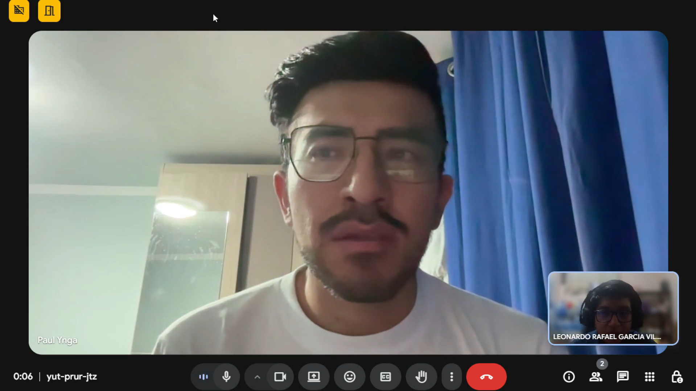
   <i>Evidencia de entrevista: Paul Ynga</i>

- **Nombre:** Antony Paul Ynga Carbajal
- **Edad:** 34 años
- **Residencia:** Miraflores
- **Enlace de la entrevista:** [Ver grabación aquí](https://upcedupe-my.sharepoint.com/personal/u20231h059_upc_edu_pe/_layouts/15/stream.aspx?id=%2Fpersonal%2Fu20231h059%5Fupc%5Fedu%5Fpe%2FDocuments%2FEntrevistas%20Aplicaciones%20Web%2FEntrevistas%20SENIT%2Emp4&nav=eyJyZWZlcnJhbEluZm8iOnsicmVmZXJyYWxBcHAiOiJPbmVEcml2ZUZvckJ1c2luZXNzIiwicmVmZXJyYWxBcHBQbGF0Zm9ybSI6IldlYiIsInJlZmVycmFsTW9kZSI6InZpZXciLCJyZWZlcnJhbFZpZXciOiJNeUZpbGVzTGlua0NvcHkifX0&ga=1&referrer=StreamWebApp%2EWeb&referrerScenario=AddressBarCopied%2Eview%2E1db915aa%2D330c%2D43a8%2Da572%2D0bc39bdd6522)
- **Duracion:** 15:37
- **Timing:** 00:00 - 15:37

**Resumen de la entrevista:**

La entrevista fue realizada a Anthony Paul Inga Carvajal, gerente de turno con más de 13 años de experiencia en el sector hotelero. En su labor, utiliza principalmente computadoras, celulares y radios para la comunicación interna, además de un sistema hotelero llamado Opera PMS, el cual centraliza la gestión de reservas, habitaciones y pagos. Nos indica que uno de los principales problemas es la desinformación de los huéspedes, quienes muchas veces no revisan correctamente las condiciones de su reserva, lo que genera conflictos tanto al ingreso como a la salida. El estado de las habitaciones se actualiza en tiempo real mediante códigos ingresados desde los teléfonos de cada habitación, permitiendo la toma de decisiones rápidas, como la asignación de habitaciones de último minuto o la gestión inmediata de pagos. En cuanto a comunicación con clientes, el correo es el canal más utilizado. Finalmente, el entrevistado destaca la necesidad de implementar una plataforma segura de comunicación directa con los huéspedes, que permita gestionar reservas, solicitudes y datos sensibles sin depender de canales externos como WhatsApp, mejorando así la seguridad y confianza.

 

#### Segmento 2: Huéspedes y clientes frecuentes de hoteles y moteles

**Entrevista 1**

  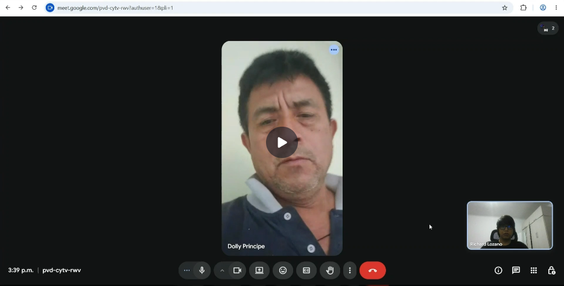
   <i>Evidencia de entrevista: Ghorghet Tuncar Vila</i>

- **Nombre:** Ghorghet Tuncar Vila
- **Edad:** 20 años
- **Residencia:** Villa María del Triunfo
- **Enlace de la entrevista:** [Ver grabación aquí](https://upcedupe-my.sharepoint.com/personal/u20231h059_upc_edu_pe/_layouts/15/stream.aspx?id=%2Fpersonal%2Fu20231h059%5Fupc%5Fedu%5Fpe%2FDocuments%2FEntrevistas%20Aplicaciones%20Web%2FEntrevistas%20SENIT%2Emp4&nav=eyJyZWZlcnJhbEluZm8iOnsicmVmZXJyYWxBcHAiOiJPbmVEcml2ZUZvckJ1c2luZXNzIiwicmVmZXJyYWxBcHBQbGF0Zm9ybSI6IldlYiIsInJlZmVycmFsTW9kZSI6InZpZXciLCJyZWZlcnJhbFZpZXciOiJNeUZpbGVzTGlua0NvcHkifX0&ga=1&referrer=StreamWebApp%2EWeb&referrerScenario=AddressBarCopied%2Eview%2E1db915aa%2D330c%2D43a8%2Da572%2D0bc39bdd6522)
- **Duracion:** 08:59
- **Timing:** 15:37 - 23:27

**Resumen de la entrevista:**

La entrevista fue realizada a Ghorghet Tuncar Vila, joven de 20 años que suele hospedarse en hoteles aproximadamente una vez al mes. Para buscar hospedajes utiliza principalmente su celular o laptop, revisando primero redes sociales como Facebook y TikTok, y luego coordinando por WhatsApp. Durante la entrevista comentó que en su última experiencia tuvo problemas porque la información del establecimiento no era clara respecto a horarios, servicios y disponibilidad, lo que volvió más lento el proceso de reserva. También señaló dificultades en el check-in y check-out debido a la poca comunicación del anfitrión, además de inconvenientes con los métodos de pago por no saber con anticipación si aceptaban efectivo, tarjeta o billeteras digitales. A pesar de ello, indicó que la habitación sí se encontraba limpia y ordenada. Finalmente, destacó que valora mucho el precio, la comodidad y la privacidad, y que le gustaría contar con una plataforma más clara y eficiente que le permita ver información importante, recibir confirmaciones rápidas y realizar un pre check-in sin depender únicamente de WhatsApp.

 

**Entrevista 2**

  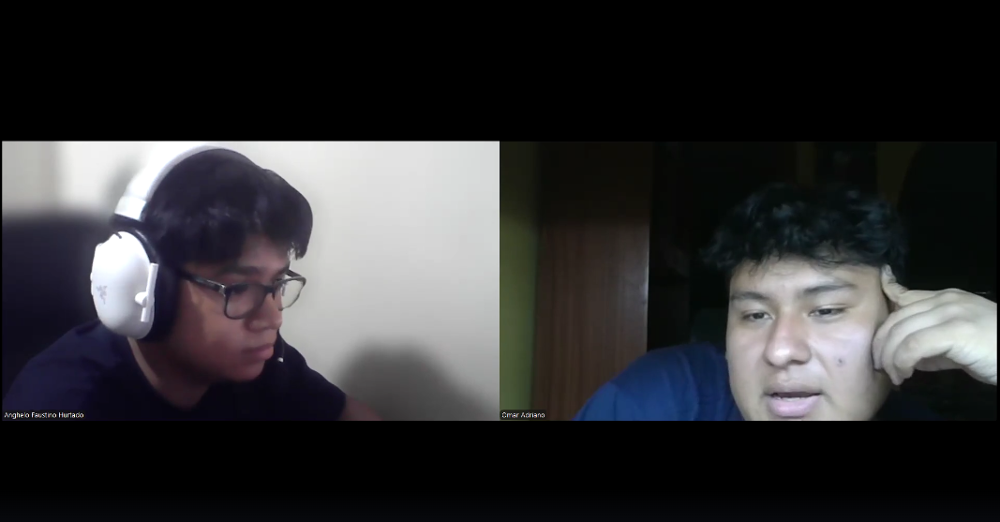
   <i>Evidencia de entrevista: Omar Adriano Rojas</i>

* **Nombre:** Omar Adriano Rojas
* **Edad:** 20 años
* **Residencia:** Ate
* **Enlace de la entrevista:** [Ver grabación aquí](https://upcedupe-my.sharepoint.com/personal/u20231h059_upc_edu_pe/_layouts/15/stream.aspx?id=%2Fpersonal%2Fu20231h059%5Fupc%5Fedu%5Fpe%2FDocuments%2FEntrevistas%20Aplicaciones%20Web%2FEntrevistas%20SENIT%2Emp4&nav=eyJyZWZlcnJhbEluZm8iOnsicmVmZXJyYWxBcHAiOiJPbmVEcml2ZUZvckJ1c2luZXNzIiwicmVmZXJyYWxBcHBQbGF0Zm9ybSI6IldlYiIsInJlZmVycmFsTW9kZSI6InZpZXciLCJyZWZlcnJhbFZpZXciOiJNeUZpbGVzTGlua0NvcHkifX0&ga=1&referrer=StreamWebApp%2EWeb&referrerScenario=AddressBarCopied%2Eview%2E1db915aa%2D330c%2D43a8%2Da572%2D0bc39bdd6522)
* **Duracion:** 06:05
* **Timing:** 31:05 - 37-18

**Resumen de la entrevista:**

La entrevista fue realizada a Omar Adriano Rojas, joven de 20 años que suele hospedarse en hoteles y moteles. Para buscar y reservar hospedajes, actualmente utiliza WhatsApp, aunque expresó una fuerte preferencia por plataformas web que le permitan autogestionar su reserva viendo precios, fotos reales y disponibilidad sin tener que esperar la respuesta de un recepcionista. Durante la entrevista, destacó que su mayor frustración es la desorganización del personal y tener que esperar en recepción para el check-in (especialmente cuando la habitación aún no está limpia). Indicó que le resultaría muy atractivo un sistema que le permita hacer un pre check-in digital desde su celular. Además, señaló como aspectos críticos de su estadía la exigencia de una limpieza impecable, privacidad total y la necesidad innegociable de recibir comprobantes de pago (boletas o facturas) y correos de confirmación de manera inmediata para sentir confianza en el servicio.

**Entrevista 3**

  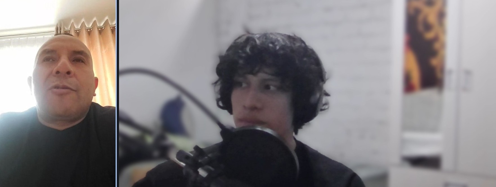
   <i>Evidencia de entrevista: Lilian Zamora Rua</i>

* **Nombre:** Lilian Zamora Rua
* **Edad:** 51 años
* **Residencia:** Lurigancho - Chosica
* **Enlace de la entrevista:** [Ver grabación aquí](https://upcedupe-my.sharepoint.com/:v:/g/personal/u20241e126_upc_edu_pe/IQBVCEhPNholRa5EfoGSoWyMAcq8SRIIGkyIQMexaJMhTu8?nav=eyJyZWZlcnJhbEluZm8iOnsicmVmZXJyYWxBcHAiOiJPbmVEcml2ZUZvckJ1c2luZXNzIiwicmVmZXJyYWxBcHBQbGF0Zm9ybSI6IldlYiIsInJlZmVycmFsTW9kZSI6InZpZXciLCJyZWZlcnJhbFZpZXciOiJNeUZpbGVzTGlua0NvcHkifX0&e=hVH4To)
* **Duracion:** 07:38
* **Timing:** 00:00 - 07:38

**Resumen de la entrevista:**

Esta es una entrevista detallada a una viajera frecuente de 51 años sobre sus hábitos de alojamiento y experiencias en hoteles. La entrevistada explica que prefiere realizar sus reservas digitalmente mediante plataformas como Booking o WhatsApp, priorizando siempre la limpieza y la privacidad. Aunque se muestra satisfecha con los servicios generales, señala que el proceso de registro presencial suele ser lento debido a la gestión de documentos de identidad. Por esta razón, manifiesta un fuerte interés en la implementación de sistemas de registro anticipado que agilicen su ingreso. Finalmente, la fuente destaca la importancia de recibir confirmaciones inmediatas y transparencia total en los costos y servicios antes de concretar una estadía.

### 2.2.3 Análisis de entrevistas

## 2.3 Needfinding

### 2.3.1. User Personas.

**Segmento 1: Personal administrativo y operativo de hoteles y moteles**

  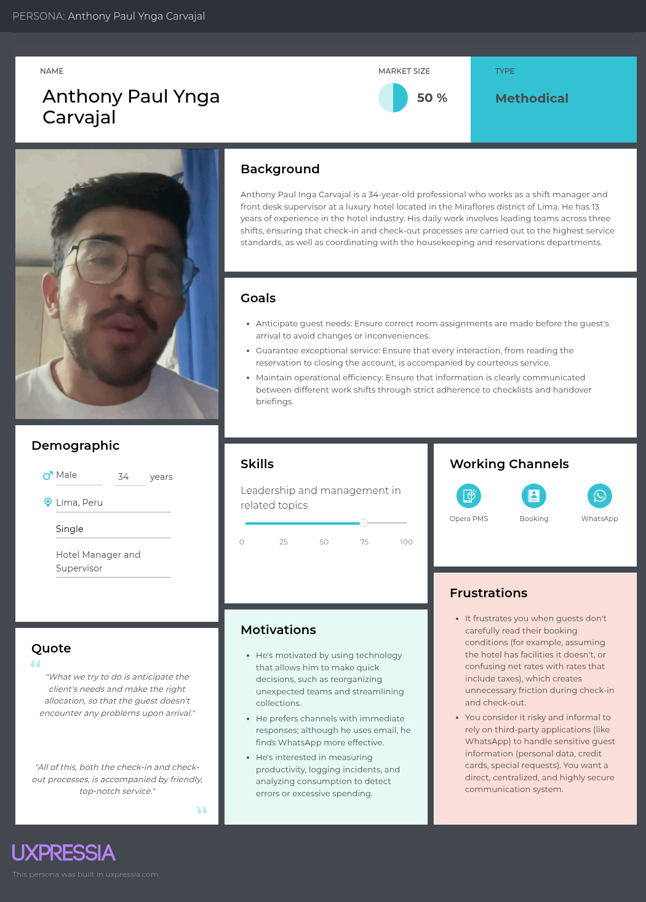
   

**Segmento 2: Huéspedes y clientes frecuentes de hoteles y moteles**

  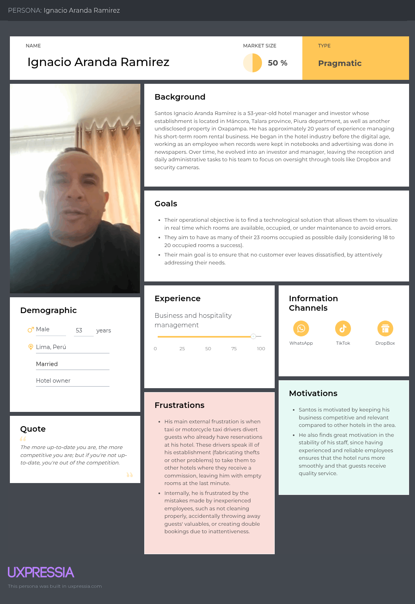
   

### 2.3.2. User Task Matrix.

**Segmento 1: Personal administrativo y operativo de hoteles y moteles**
<table>
  <thead>
    <tr>
      <th rowspan="2">Task</th>
      <th colspan="2">Anthony Ynga Carvajal</th>
    </tr>
    <tr>
      <th>Frequency</th>
      <th>Importance</th>
    </tr>
  </thead>
  <tbody>
    <tr>
      <td>Check room availability in real time</td>
      <td>High</td>
      <td>High</td>
    </tr>
     <tr>
      <td>Process payments</td>
      <td>High</td>
      <td>High</td>
    </tr>
    <tr>
      <td>Manage check-in/check-out process</td>
      <td>High</td>
      <td>High</td>
    </tr>
    <tr>
      <td>Update room status (clean, dirty, inspected)</td>
      <td>High</td>
      <td>High</td>
    </tr>
    <tr>
      <td>Assign rooms to guests</td>
      <td>High</td>
      <td>High</td>
    </tr>
    <tr>
      <td>Ensure data security in guest interactions</td>
      <td>Low</td>
      <td>High</td>
    </tr>
  </tbody>
</table>

**Segmento 2: Huéspedes y clientes frecuentes de hoteles y moteles**

<table>
  <thead>
    <tr>
      <th rowspan="2">Task</th>
      <th colspan="2">Anthony Ynga Carvajal</th>
      <th colspan="2">Ghorghet Tuncar Vila</th>
      <th colspan="2">Omar Adriano</th>
    </tr>
    <tr>
      <th>Frequency</th>
      <th>Importance</th>
      <th>Frequency</th>
      <th>Importance</th>
      <th>Frequency</th>
      <th>Importance</th>
    </tr>
  </thead>
  <tbody>
    <tr>
      <td>Perform check-in at hotel</td>
      <td>High</td>
      <td>High</td>
      <td>High</td>
      <td>High</td>
      <td>High</td>
      <td>High</td>
    </tr>
     <tr>
      <td>Make payments</td>
      <td>High</td>
      <td>High</td>
      <td>High</td>
      <td>High</td>
      <td>High</td>
      <td>High</td>
    </tr>
    <tr>
      <td>Receive electronic invoice</td>
      <td>High</td>
      <td>High</td>
      <td>Low</td>
      <td>Low</td>
      <td>High</td>
      <td>High</td>
    </tr>
    <tr>
      <td>Review room conditions (cleanliness, privacy)</td>
      <td>High</td>
      <td>High</td>
      <td>High</td>
      <td>High</td>
      <td>High</td>
      <td>High</td>
    </tr>
    <tr>
      <td>Manage bookings (changes/cancellations)</td>
      <td>Normally</td>
      <td>Normally</td>
      <td>High</td>
      <td>High</td>
      <td>Low</td>
      <td>High</td>
    </tr>
    <tr>
      <td>Wait during check-in process</td>
      <td>High</td>
      <td>Low</td>
      <td>High</td>
      <td>High</td>
      <td>High</td>
      <td>Low</td>
    </tr>
  </tbody>
</table>

### 2.3.3. User Journey Mapping.

**Segmento 1: Personal administrativo y operativo de hoteles y moteles**

  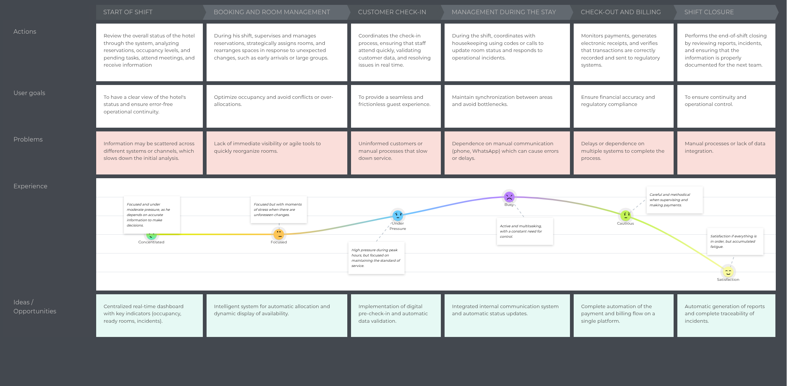
   

**Segmento 2: Huéspedes y clientes frecuentes de hoteles y moteles**

  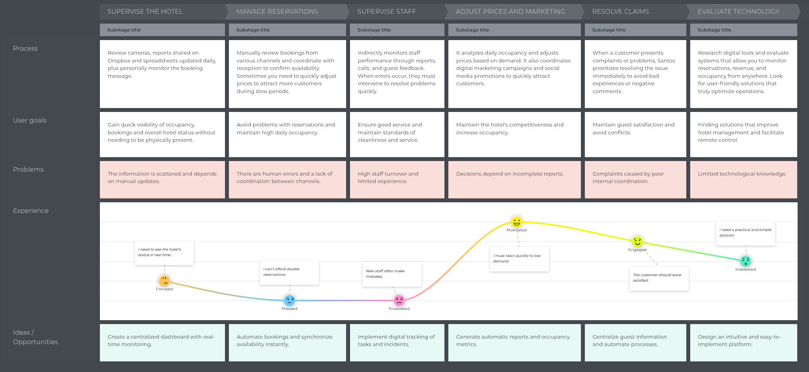
   

### 2.3.4. Empathy Mapping.
**Segmento 1: Personal administrativo y operativo de hoteles y moteles**

  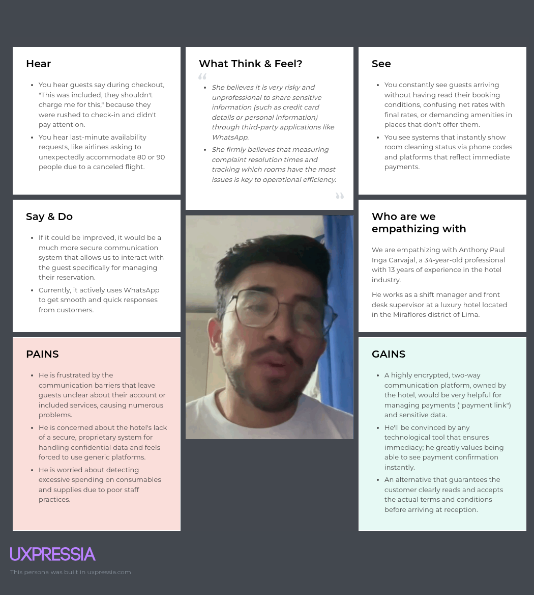
   

**Segmento 2: Huéspedes y clientes frecuentes de hoteles y moteles**

  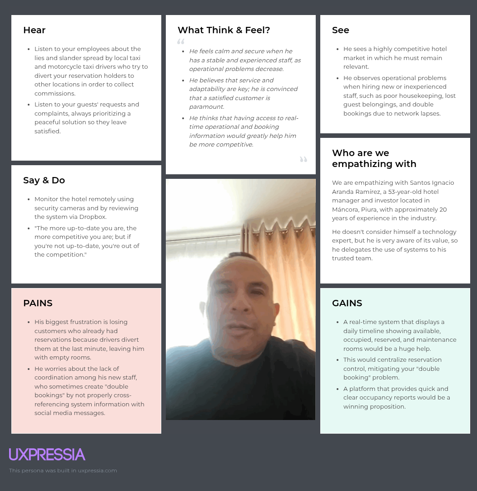
   

## 2.4. Big Picture Event Storming.

Explicacion 

**Metodología aplicada**

**Big Picture Event Storming - Leyenda**

**Big Picture Event Storming - Mapa**

**Interpretación de hallazgos clave**

## 2.5. Ubiquitous Language

En esta sección del documento se da a conocer el glosario de términos del dominio de negocio que se utilizó en el proyecto Senit. La idea de ese lenguaje ubicuo es que todos los integrantes del grupo y las personas implicadas en el proyecto se manejen con la misma terminología a la hora de hablar del problema, de la solución y de la explotación diaria del negocio, de tal forma que se evite la confusión y se consiga una comunicación más clara de los principales procesos de los hoteles y moteles.

- **Guest (Huésped):** Es la persona que se aloja en el establecimiento y hace uso de una habitación durante un tiempo determinado. En otras palabras, es quien vive directamente la experiencia del servicio, desde su llegada hasta su salida.

- **Customer (Cliente):** Es la persona que realiza la reserva o el pago del servicio. A veces el cliente y el huésped son la misma persona, pero no siempre, porque también puede pasar que alguien reserve o pague por otra persona.

- **Reservation (Reserva):** Es el registro previo mediante el cual un cliente solicita una habitación para una fecha, horario o periodo específico. Básicamente, representa la intención confirmada de hospedarse antes de llegar al establecimiento.

- **Walk-in Guest (Huésped sin reserva):** Es el cliente que llega directamente al hotel o motel sin haber reservado antes. Este caso es importante porque obliga al negocio a validar la disponibilidad en ese mismo momento.

- **Check-in:** Es el proceso de ingreso del huésped. Aquí se confirma su llegada, se valida su reserva o atención directa y se le asigna formalmente una habitación para iniciar su estadía.

- **Check-out:** Es el proceso de salida del huésped. En este momento se da por terminada la estadía, se revisan los consumos realizados y se completa el pago correspondiente, si todavía hubiera algo pendiente.

- **Room (Habitación):** Es el espacio de alojamiento que el establecimiento pone a disposición de los huéspedes. Cada habitación forma parte central de la operación, ya que de ella dependen la reserva, la ocupación, la limpieza y la tarifa.

- **Room Type (Tipo de habitación):** Es la categoría que permite diferenciar una habitación de otra según sus características. Por ejemplo, puede variar por tamaño, comodidad, equipamiento, capacidad o servicios incluidos.

- **Room Status (Estado de habitación):** Es la condición en la que se encuentra una habitación en un momento específico. Este estado ayuda a saber si está libre, ocupada, reservada, en limpieza o bloqueada, y por eso es clave para la operación diaria.

- **Availability (Disponibilidad):** Es la condición que indica si una habitación puede ser asignada o reservada. Este término es fundamental porque afecta directamente la atención al cliente y la toma de decisiones en recepción.

- **Rate (Tarifa):** Es el precio que se cobra por el uso de una habitación. Esta tarifa puede variar según el tipo de habitación, el tiempo de estadía o las condiciones del servicio ofrecido.

- **Front Desk (Recepción):** Es el área encargada de atender al huésped en su llegada, durante su permanencia y al momento de su salida. Además, desde recepción se coordinan procesos importantes como reservas, check-in, check-out y consultas generales.

- **Housekeeping (Limpieza de habitaciones):** Es el área o conjunto de actividades relacionadas con la limpieza, orden y preparación de las habitaciones. Su trabajo influye directamente en la disponibilidad y en la calidad percibida por el huésped.

- **Shift (Turno):** Es el periodo de trabajo asignado al personal del establecimiento. Este término es importante porque la operación del negocio depende de que cada turno mantenga continuidad en la atención y el control de las habitaciones.

- **Staff (Personal):** Se refiere al conjunto de trabajadores que participan en la operación del negocio, como recepcionistas, administradores, personal de limpieza u otros colaboradores.

- **Consumption (Consumo):** Es el registro de productos o servicios adicionales que utiliza el huésped durante su estadía. Estos consumos luego deben ser considerados en el cierre de cuenta o en la facturación final.

- **Payment (Pago):** Es la acción mediante la cual el cliente cancela el monto correspondiente a la habitación y a los consumos realizados. Es uno de los procesos más sensibles, porque debe quedar claro, correcto y bien registrado.

- **Invoice (Factura):** Es el comprobante de pago que se emite cuando el servicio debe registrarse a nombre de una empresa o contribuyente. Tiene un uso más formal y tributario dentro de la operación.

- **Receipt (Boleta):** Es el comprobante de pago que normalmente se emite a nombre de una persona natural por el servicio brindado. Es uno de los documentos más comunes en la atención al cliente final.

- **Overbooking (Sobre-reserva):** Es la situación en la que se confirma más de una reserva para una misma habitación o para una capacidad que realmente no está disponible. Este problema afecta de forma directa la experiencia del cliente y la credibilidad del establecimiento.
---
# Capítulo III: Requirements Specification

## 3.1. User Stories.

| Epic / Story ID | Título | Descripción | Criterios de Aceptación | Relacionado con (Epic ID) |
| :--- | :--- | :--- | :--- | :--- |
| **EP-01** | Presentación inicial de Senit | Se reúne todo lo necesario para la elaboración de la landing page, con el objetivo de presentar la propuesta de valor de Senit, sus funcionalidades, planes de suscripción y un medio de contacto con los clientes potenciales. | **-** | **-** |
| **EP-02** | Gestión del Rack y Operaciones de Recepción | Se define el desarrollo del sistema web principal de Senit (PMS), permitiendo a los recepcionistas visualizar la disponibilidad de habitaciones, registrar ingresos por horas, gestionar cuentas y realizar el check-out de manera eficiente. | **-** | **-** |
| **US-01** | Primera impresión sobre Senit | Como visitante del segmento de administración, quiero entender rápidamente qué es Senit y qué problema resuelve, para saber si puede ayudarme a mejorar la gestión de mi negocio. | **Escenario 1: Visualización de la sección inicial**  Dado que el administrador ingresa a la landing page  Cuando se carga la sección de inicio Entonces debe visualizar una descripción clara y breve sobre Senit   **Escenario 2: Comprensión del servicio**  Dado que el administrador revisa la información principal  Cuando lee el contenido  Entonces debe entender el objetivo principal del producto   | **EP-01** |
| **US-02** | Navegación entre secciones | Como visitante, quiero desplazarme fácilmente entre las secciones de la página, para encontrar rápidamente la información que necesito | **Escenario 1: Opciones de navegación**  Dado que el visitante ingresa a la landing page  Cuando se carga la página  Entonces debe visualizar una barra de navegación horizontal con las secciones de inicio, funcionalidades, planes, contacto e ingreso  **Escenario 2: Redirección automática de secciones**  Dado que el visitante se encuentra en la landing page  Cuando selecciona una opción del menú  Entonces debe dirigirse a la sección correspondiente   | **EP-01** |
| **US-03** | Información sobre funcionalidades | Como visitante del segmento de administración, quiero conocer las funcionalidades que ofrece Senit, para evaluar si es útil para las necesidades del hospedaje | **Escenario 1: Revisión de funcionalidades**  Dado que el administrador revisa la sección de funcionalidades  Cuando termina de leer el contenido  Entonces debe comprender que Senit mejora la administración del hospedaje al permitir gestionar reservas, habitaciones, limpieza, personal y facturación   | **EP-01** |
| **US-04** | Planes de suscripción | Como visitante del segmento de administración, quiero revisar los planes disponibles, para identificar cuál se ajusta mejor a mi hospedaje | **Escenario 1: Visualización de los planes disponibles**  Dado que el administrador se encuentra en la sección de planes de suscripción  Cuando visualiza los planes disponibles  Entonces debe poder comparar fácilmente lo que ofrece el plan básico, pro y enterprise  **Escenario 2: Selección del plan más adecuado**  Dado que el administrador ha revisado los planes de suscripción  Cuando elige la suscripción que desea adquirir  Entonces se le redirecciona a la ventana de ingreso   | **EP-01** |
| **US-05** | Sección de contacto | Como visitante del segmento de administración, quiero encontrar un formulario de contacto, para poder solicitar más información o una demostración del servicio | **Escenario 1: Acceso al formulario de contacto**  Dado que el administrador se encuentra en la sección de contacto  Cuando visualiza el contenido  Entonces debe encontrar un formulario con los campos necesarios para poder enviar su mensaje  **Escenario 2: Envío correcto del formulario**  Dado que el administrador completa el formulario  Cuando pulsa el botón de enviar  Entonces debe mostrarse un mensaje de confirmación de envío  **Escenario 3: Envío incorrecto del formulario**  Dado que el administrador no completa correctamente el formulario  Cuando pulsa el botón de enviar  Entonces se le debe mostrar una alerta que le indique los campos que no ingresó correctamente   | **EP-01** |
| **US-06** | Cambio de idioma | Como visitante, quiero cambiar el idioma de la página entre español e inglés, para entender mejor la información | **Escenario 1: Opción de cambio de idioma**  Dado que el visitante ingresa a la landing page  Cuando se carga la página  Entonces debe visualizar una opción para cambiar el idioma  **Escenario 2: Cambio de idioma**  Dado que el visitante quiere cambiar el idioma  Cuando selecciona un idioma disponible  Entonces el contenido debe mostrarse en el idioma seleccionado   | **EP-01** |
| **US-07** | Redes sociales | Como administrador de un hospedaje interesado en Senit, quiero encontrar enlaces a redes sociales y medios de contacto, para conocer más sobre Senit | **Escenario 1: Sección inferior de la página**  Dado que el administrador se encuentra en la última sección de la landing page  Cuando revisa la zona final de la página  Entonces debe encontrar enlaces a redes sociales y datos de contacto  **Escenario 2: Redirección**  Dado que el administrador selecciona una red social  Cuando hace clic en alguno de los íconos  Entonces debe ser redirigido a la red social elegida   | **EP-01** |
| **US-08** | Compatibilidad de la landing page con dispositivos móviles | Como visitante que ingresa a la landing page desde su celular, quiero que la página se adapte al tamaño de mi pantalla, para navegar el sitio con normalidad | **Escenario 1: Reordenamiento de la página para celular**  Dado que el visitante ingresa desde un dispositivo móvil  Cuando se carga la página  Entonces los elementos de la página deben ajustarse correctamente al tamaño de la pantalla  **Escenario 2: Menú de navegación móvil**  Dado que el visitante ingresó desde un celular  Cuando presiona el ícono de tres líneas en la parte superior  Entonces debe mostrarse una barra de navegación vertical con las secciones principales para desplazarse  **Escenario 3: Navegación móvil**  Dado que el visitante tiene la barra de navegación vertical activa  Cuando presiona alguna de las secciones  Entonces la barra de navegación debe ocultarse y redigirse a la sección elegida   | **EP-01** |
| **US-09** | Visualización del Rack Gráfico | Como recepcionista del hospedaje, quiero ver un panel visual con todas las habitaciones y sus estados actuales, para identificar rápidamente la disponibilidad al atender a un cliente. | **Escenario 1: Vista general del estado**  Dado que el recepcionista ingresa a la plataforma web  Cuando navega a la sección "Rack de Habitaciones"  Entonces debe ver los cuartos representados con colores distintos según su estado (Libre, Ocupada, En Limpieza)  **Escenario 2: Actualización en tiempo real**  Dado que el recepcionista está mirando el Rack  Cuando el estado de una habitación cambia  Entonces el color y estado deben actualizarse inmediatamente sin necesidad de recargar la página   | **EP-02** |
| **US-10** | Registro de Check-in por bloques de horas | Como recepcionista del hospedaje, quiero registrar la entrada de un huésped seleccionando un bloque de horas, para calcular automáticamente su hora de salida y el costo inicial. | **Escenario 1: Ingreso exitoso por horas**  Dado que el recepcionista selecciona una habitación libre  Cuando ingresa los datos y selecciona una tarifa de "4 horas"  Entonces el sistema calcula la hora de salida exacta y cambia la habitación a estado Ocupado  **Escenario 2: Restricción de habitación**  Dado que el recepcionista intenta hacer check-in  Cuando selecciona una habitación que está en estado "Sucia"  Entonces el sistema muestra un mensaje de error impidiendo el registro   | **EP-02** |
| **US-11** | Alertas de tiempo de estadía por vencer | Como recepcionista del hospedaje, quiero que el sistema me notifique cuando el tiempo de una habitación esté por expirar, para poder avisar al huésped con anticipación. | **Escenario 1: Alerta visual de tiempo**  Dado que una habitación está alquilada por horas  Cuando falten 15 minutos para su hora de salida calculada  Entonces el sistema debe mostrar un icono de alerta visual parpadeante en esa habitación dentro del Rack   | **EP-02** |
| **US-12** | Visualización de detalles de ocupación | Como recepcionista del hospedaje, quiero hacer clic en una habitación ocupada para ver sus detalles, para informar al cliente cuánto tiempo le queda o su deuda actual. | **Escenario 1: Despliegue de información**  Dado que el recepcionista hace clic en una habitación ocupada  Cuando se abre la ventana de detalles  Entonces debe visualizar la hora de entrada, hora límite de salida, y el monto total acumulado a pagar   | **EP-02** |
| **US-13** | Agregar consumos adicionales al cuarto | Como recepcionista del hospedaje, quiero agregar productos o servicios extra a la cuenta de la habitación, para cobrar el monto total en una sola transacción al final. | **Escenario 1: Suma de productos a la cuenta**  Dado que el recepcionista abre los detalles de una habitación ocupada  Cuando selecciona un producto del inventario (ej. agua) y confirma  Entonces el costo de ese producto se suma automáticamente a la deuda final de esa habitación   | **EP-02** |
| **US-14** | Registro de Check-out y cambio a limpieza | Como recepcionista del hospedaje, quiero finalizar la estadía de una habitación, para realizar el cobro y notificar que el cuarto necesita aseo. | **Escenario 1: Finalización de estadía**  Dado que el recepcionista selecciona la opción "Check-out"  Cuando confirma la recepción del pago total  Entonces el sistema cierra la cuenta y cambia la habitación de "Ocupada" a estado "En Limpieza"   | **EP-02** |
| **US-15** | Habilitación de habitación limpia | Como recepcionista del hospedaje, quiero marcar una habitación como "Limpia" una vez finalizado el aseo, para que vuelva a estar disponible para un nuevo alquiler. | **Escenario 1: Liberar la habitación**  Dado que una habitación se encuentra en estado "En Limpieza"  Cuando el recepcionista presiona el botón "Marcar como Libre"  Entonces el color de la habitación cambia y el cuarto vuelve a estar disponible para hacer check-in   | **EP-02** |
| **US-16** | Filtros rápidos en el Rack Gráfico | Como recepcionista del hospedaje, quiero filtrar las habitaciones por su estado actual, para encontrar más rápido los cuartos que están listos para ser alquilados. | **Escenario 1: Filtrado de cuartos disponibles**  Dado que el recepcionista visualiza el Rack completo  Cuando hace clic en el botón de filtro "Mostrar solo Libres"  Entonces el panel oculta las habitaciones ocupadas o sucias, mostrando únicamente las disponibles   | **EP-02** |

## 3.2. Impact Mapping

 
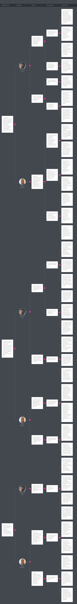
 

## 3.3. Product Backlog
| # Orden | User Story Id | Título | Descripción | Story Points |
|--------:|---------------|--------|-------------|--------------|
| 1 | US-01 | Primera impresión sobre Senit | Como visitante del segmento de administración, quiero entender rápidamente qué es Senit y qué problema resuelve, para saber si puede ayudarme a mejorar la gestión de mi negocio. | 3 |
| 2 | US-02 | Navegación entre secciones | Como visitante, quiero desplazarme fácilmente entre las secciones de la página, para encontrar rápidamente la información que necesito. | 2 |
| 3 | US-03 | Información sobre funcionalidades | Como visitante del segmento de administración, quiero conocer las funcionalidades que ofrece Senit, para evaluar si es útil para las necesidades del hospedaje. | 3 |
| 4 | US-04 | Planes de suscripción | Como visitante del segmento de administración, quiero revisar los planes disponibles, para identificar cuál se ajusta mejor a mi hospedaje. | 3 |
| 5 | US-05 | Sección de contacto | Como visitante del segmento de administración, quiero encontrar un formulario de contacto, para poder solicitar más información o una demostración del servicio. | 5 |
| 6 | US-08 | Compatibilidad de la landing page con dispositivos móviles | Como visitante que ingresa a la landing page desde su celular, quiero que la página se adapte al tamaño de mi pantalla, para navegar el sitio con normalidad. | 5 |
| 7 | US-06 | Cambio de idioma | Como visitante, quiero cambiar el idioma de la página entre español e inglés, para entender mejor la información. | 5 |
| 8 | US-07 | Redes sociales | Como administrador de un hospedaje interesado en Senit, quiero encontrar enlaces a redes sociales y medios de contacto, para conocer más sobre Senit. | 2 |
| 9 | US-09 | Visualización del Rack Gráfico | Como recepcionista del hospedaje, quiero ver un panel visual con todas las habitaciones y sus estados actuales, para identificar rápidamente la disponibilidad al atender a un cliente. | 8 |
| 10 | US-10 | Registro de Check-in por bloques de horas | Como recepcionista del hospedaje, quiero registrar la entrada de un huésped seleccionando un bloque de horas, para calcular automáticamente su hora de salida y el costo inicial. | 8 |
---
# Capítulo IV: Product Design

## 4.1. Style Guidelines.
### 4.1.1. General Style Guidelines.
Esta sección reúne las pautas de diseño y estilo que se utilizarán en la plataforma Senit. Su objetivo es mantener coherencia en la apariencia y en la forma de comunicar la información, logrando que el sistema sea claro, ordenado y fácil de usar para los usuarios.

**Band Name**
El nombre de nuestro proyecto es Senit, el cual es corto, fácil de recordar y tiene un enfoque moderno. Representa una herramienta tecnológica orientada a mejorar la gestión de hospedajes, permitiendo organizar procesos como reservas, control de habitaciones y facturación de manera más eficiente.

*Logotipo*

El logotipo de Senit tiene un diseño simple y moderno. Está formado por un ícono geométrico que representa la organización de habitaciones o un sistema tipo panel (dashboard), junto con el nombre “Senit” en una tipografía clara.
Las formas redondeadas ayudan a que el diseño se vea más amigable, mientras que la estructura del ícono transmite orden y control.
El logo busca reflejar:
  - Organización
  - Tecnología
  - Eficiencia

La **tipografía** utilizada es de estilo sans-serif moderno, con un enfoque geométrico que se adapta bien a entornos digitales.
En el logotipo, el texto “Senit” utiliza un peso bold o semi-bold, lo que permite que sea fácil de identificar. Las letras tienen formas redondeadas, lo cual se puede notar especialmente en caracteres como la “S”, “e” y “n”. Esto ayuda a que el diseño se vea más amigable y no tan rígido.
Además, el espaciado entre letras está bien ajustado, logrando una apariencia compacta y ordenada. La altura de las letras también favorece la legibilidad, sobre todo en pantallas.
En general, la tipografía transmite claridad, modernidad y es fácil de leer.

La **paleta de colores** de Senit está basada en tonos que transmiten tecnología y eficiencia, manteniendo un equilibrio visual.
- En el isotipo (ícono):
Se utiliza el azul (#2563EB) como color principal en la mayoría de los bloques, representando confianza y tecnología.
Se incluye un verde (#10B981) en uno de los bloques, que funciona como acento visual y está relacionado con eficiencia y gestión.
- En el nombre “Senit”:
Se usa un azul más oscuro (aproximadamente #1E3A8A), lo que permite diferenciar el texto del ícono y generar un mejor contraste.
En conjunto, los colores permiten que el logo sea claro, moderno y fácil de reconocer, además de mantener coherencia con la idea de una plataforma tecnológica.

  

### 4.1.2. Web Style Guidelines.
La plataforma Senit está diseñada para ser fácil de usar y entendible desde el primer momento. Como el sistema reúne varias funciones como reservas, habitaciones, personal y facturación, se busca que todo esté bien organizado y sin elementos que recarguen la pantalla. La idea es que el usuario pueda encontrar lo que necesita rápido y sin complicaciones.
La navegación es simple e intuitiva, con las opciones principales visibles y bien ubicadas para facilitar el acceso a cada sección. También se incluyen mensajes claros cuando el usuario realiza alguna acción, como guardar o editar información, para que siempre sepa lo que está pasando en el sistema.
Además, la plataforma está estructurada por módulos, lo que ayuda a mantener el orden y mejora la experiencia de uso. Todo esto se complementa con un diseño adaptable, que permite usar Senit tanto en computadora como en dispositivos móviles sin perder funcionalidad.

### 4.2. Information Architecture

La arquitectura de información de **Senit** ha sido diseñada en dos frentes clave: la **Landing Page** (orientada a la conversión y captación de nuevos clientes) y la **Plataforma Web** (orientada a garantizar que administradores, recepcionistas y personal de limpieza accedan a las funciones operativas de manera rápida y sin fricciones).

#### 4.2.1. Organization Systems

La información se ha estructurado considerando la naturaleza de cada plataforma:

| Tipo de Organización | Descripción | Aplicación en Senit |
| :--- | :--- | :--- |
| **Secuencial (One-Page)** | Flujo de información vertical y continuo diseñado para guiar al visitante hacia la conversión. | Aplicado en la **Landing Page**, estructurando el contenido en: Hero (Inicio) -> Funcionalidades -> Confianza -> Planes -> Contacto. |
| **Jerárquica** | Estructura de árbol que divide la plataforma por niveles de acceso y módulos generales. | Aplicado en la **App Web** con el menú dividido en: Dashboard, Operaciones (Rack/Reservas), Administración y Reportes. |
| **Por Tareas** | Organización basada en las acciones específicas que el usuario debe completar. | Módulo de "Check-in rápido", "Corte de caja diario" y "Reporte de limpieza". |
| **Por Roles** | Segmentación del contenido según los permisos del perfil de usuario. | Recepcionista (Vista operativa), Administrador (Vista gerencial) y Camarista (Vista de mantenimiento). |

#### 4.2.2. Labeling Systems

Las etiquetas han sido seleccionadas para utilizar el lenguaje estándar del sector hotelero y facilitar la comprensión inmediata.

| Categoría | Etiqueta (Label) | Descripción / Contexto |
| :--- | :--- | :--- |
| **Navegación (Landing)** | Planes / Funcionalidades | Enlaces principales para conocer el modelo de negocio. |
| **Navegación (App)** | Rack Gráfico | Panel visual de estado de habitaciones en tiempo real. |
| **Acción (Botón)** | Comenzar / Ingresa | Llamados a la acción (CTAs) principales en la Landing Page. |
| **Acción (Botón)** | Check-in / Out | Registro de ingreso y salida formal del huésped en el sistema. |
| **Acción (Botón)** | Emitir Comprobante | Generación de boleta o factura electrónica integrada con SUNAT. |
| **Estados (App)** | En Limpieza | Indica que la habitación ha sido desocupada y está siendo aseada. |

#### 4.2.3. SEO Tags and Meta Tags

Para asegurar un correcto posicionamiento orgánico de la Landing Page en los motores de búsqueda, se definieron las siguientes etiquetas:

| Tag | Contenido Sugerido | Propósito |
| :--- | :--- | :--- |
| **Title Tag** | Senit \| Software de Gestión Hotelera para PyMEs en Perú | Resumen atractivo y claro para atraer dueños de hospedajes en los resultados de búsqueda. |
| **Meta Description** | Optimiza tu hostal o motel con Senit. Control por horas, gestión de limpieza en tiempo real y facturación SUNAT integrada. | Descripción directa para aumentar la tasa de clics (CTR) destacando el valor principal. |
| **Keywords** | software hotelero peru, gestión moteles por horas, sistema para hostales, facturacion electronica hoteles, pms peru. | Palabras clave para atraer tráfico orgánico de clientes potenciales específicos en Perú. |
| **Author** | Senit Startup Team | Identificación de la propiedad intelectual y desarrollo del sitio. |

#### 4.2.4. Searching Systems

El sistema de búsqueda está enfocado en la Plataforma Web para agilizar la operatividad diaria del personal:

| Sistema de Búsqueda | Parámetros de Búsqueda | Funcionalidad |
| :--- | :--- | :--- |
| **Búsqueda de Huéspedes** | DNI, RUC, Nombre o Apellido. | Localización rápida de clientes recurrentes o registros actuales en recepción. |
| **Filtros de Rack** | Por piso, tipo de habitación (Simple, Matrimonial) o estado (Libre/Ocupada). | Permite al recepcionista encontrar habitaciones disponibles inmediatamente. |
| **Búsqueda de Reservas** | Código de reserva o rango de fechas. | Gestión de reservas futuras, confirmaciones y modificaciones. |
| **Búsqueda de Ventas** | Número de comprobante o fecha de emisión. | Auditoría de pagos, revisión de caja y exportación de reportes financieros. |

#### 4.2.5. Navigation Systems

Se han diseñado sistemas de navegación distintos para la cara pública y la herramienta de gestión:

| Tipo de Navegación | Elementos Incluidos | Descripción |
| :--- | :--- | :--- |
| **Global (Landing Page)** | Header (Barra Superior Estática) | Permite la navegación rápida mediante anclajes (Inicio, Funcionalidades, Planes, Contáctanos). Incluye selector de idioma (EN/ES) y botón "Ingresa". En dispositivos móviles se agrupa en un menú hamburguesa. |
| **Global (App Web)** | Sidebar (Menú Lateral Izquierdo) | Acceso permanente a los módulos operativos internos: Inicio, Rack, Caja, Inventario y Reportes. |
| **Local** | Tabs superiores (Pestañas) | Navegación interna dentro de un módulo (ej. Reservas Pendientes vs. Finalizadas). |
| **Contextual** | Menú desplegable en Habitaciones | Al hacer clic en un cuarto del rack, despliega acciones inmediatas como "Ver cuenta", "Check-out" o "Pasar a Limpieza". |
| **De Usuario** | Header interno (Barra Superior) | Muestra el perfil del usuario activo (ej. Recepcionista Turno Mañana), notificaciones del sistema y la opción de cerrar sesión. |

## 4.3. Landing Page UI Design.
### 4.3.1. Landing Page Wireframe.

  

  

  

  

 

 

 

 

 

 

 

 

 

 

 

### 4.3.2. Landing Page Mock-up.

  

  

  

  

 

 

 

 

 

 

## 4.4. Web Applications UX/UI Design.
### 4.4.1. Web Applications Wireframes.
### 4.4.2. Web Applications Wireflow Diagrams.
### 4.4.3. Web Applications Mock-ups.
### 4.4.4. Web Applications User Flow Diagrams.
## 4.5. Web Applications Prototyping.

## 4.6. Domain-Driven Software Architecture.
Para el modelo de arquitectura del sistema Senit se utiliza la técnica de modelado C4 Model, con el objetivo de representar de manera clara la estructura y comportamiento del sistema. 

### 4.6.1. Design-Level Event Storming.
En esta sección se representan los principales eventos, comandos, agregados y consultas del dominio, utilizando el lenguaje ubicuo definido. Este modelo permite comprender los flujos clave del sistema y su comportamiento desde la perspectiva de Domain-Driven Design.

  

### 4.6.2. Software Architecture Context Diagram.
Este es el diagrama de Contexto de nuestro sistema:

  

### 4.6.3. Software Architecture Container Diagrams.
Este es el diagrama de Contenedores de nuestro sistema:

  

### 4.6.4. Software Architecture Components Diagrams.
Estos son los diagramas de componentes de nuestro sistema, incluyen los siguientes Bounded Context:

  

## 4.7. Software Object-Oriented Design.
### 4.7.1. Class Diagrams.

 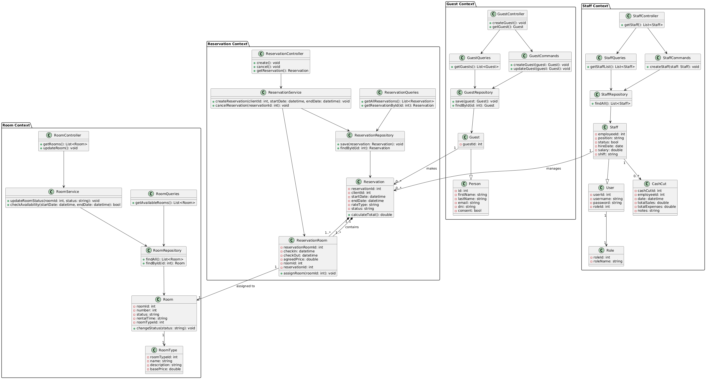

**Guest Context**

 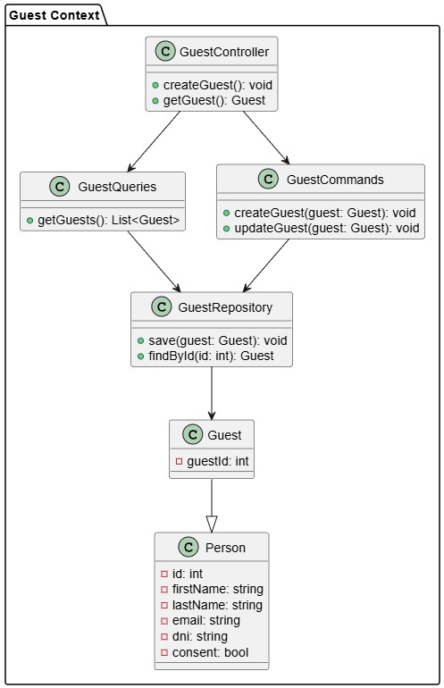

**Reservation Context**

 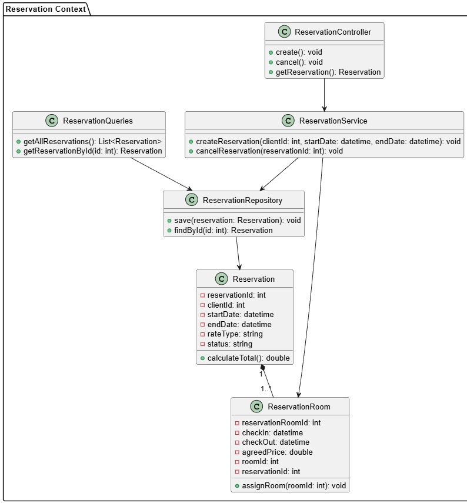

**Room Context**

 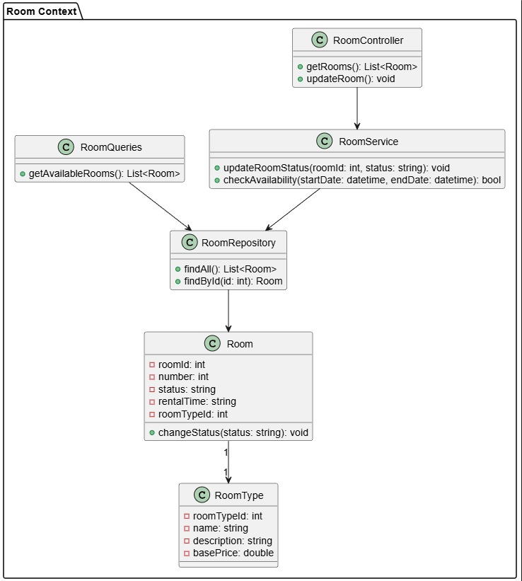

 **Staff Context**
 

 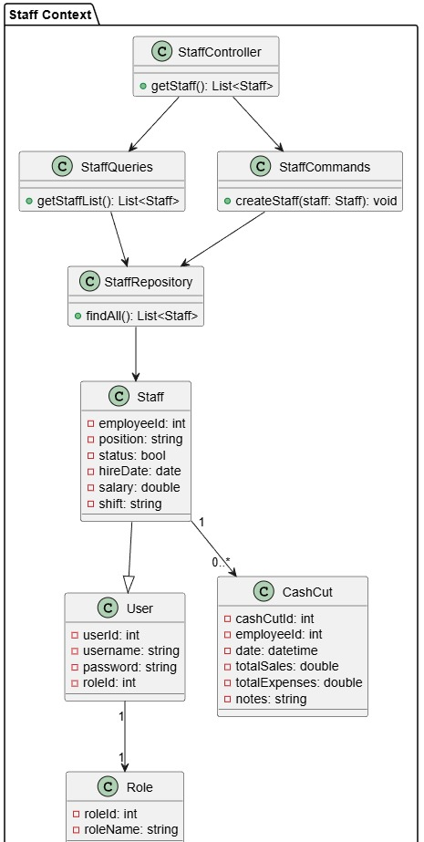

## 4.8. Database Design.
### 4.8.1. Database Diagrams.

 

 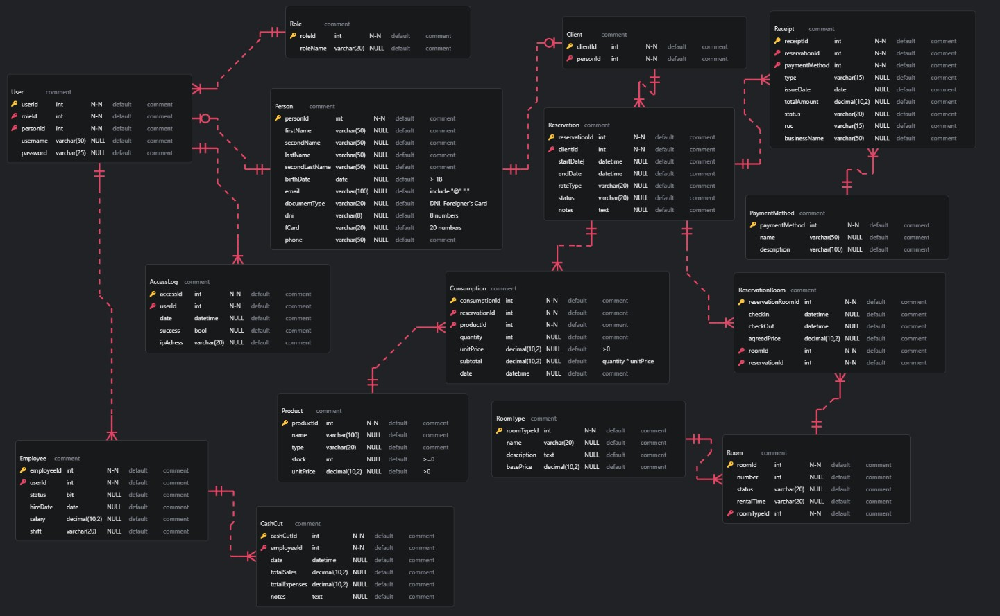

---
# Capítulo V: Product Implementation, Validation & Deployment.
## 5.1. Software Configuration Management.
En la siguiente sección, se describirán las herramientas, convenciones, referencias y configuraciones utilizadas durante el desarrollo del proyecto, las cuales contribuyeron a mantener la consistencia del trabajo realizado.
### 5.1.1. Software Development Environment Configuration.

A continuación se detallan los productos de software que se emplearon en el proyecto según las distintas actividades desarrolladas.

**Project Management**

WhatsApp: Es una aplicación de mensajería instantánea que facilita la comunicación ágil y en tiempo real entre las personas. La utilizamos para mantener una comunicación continua entre los integrantes del proyecto y coordinar las tareas que debían realizarse. https://web.whatsapp.com/

Google Meet: Es una plataforma de videoconferencias que permite realizar reuniones virtuales con audio, video y opción de compartir pantalla. La usamos para llevar a cabo reuniones con todo el equipo y coordinar verbalmente el desarrollo del proyecto. https://meet.google.com/

Discord: Es una plataforma de comunicación en línea que permite hacer llamadas, videollamadas y chats organizados por canales. La utilizamos para reuniones rápidas entre los miembros disponibles del equipo y para resolver dudas de manera inmediata. https://discord.com/

**Requirements Management**

Trello: Es una plataforma de gestión de tareas y proyectos basada en tableros, listas y tarjetas. La utilizamos para organizar y hacer seguimiento a los sprint backlogs del proyecto. https://trello.com/es

**Product UX/UI Design**

UXPressia: Es una plataforma en línea enfocada en el diseño de experiencias de usuario, que permite crear distintos artefactos relacionados con el needfinding. La utilizamos para elaborar las user personas, user journey mapping, empathy mapping e impact mapping del proyecto. https://uxpressia.com/

Miro: Es una pizarra colaborativa digital que permite crear diagramas y esquemas de forma visual y en tiempo real. La utilizamos para desarrollar el event storming e identificar los bounded contexts del proyecto. https://miro.com/

Figma: Es una herramienta de diseño y prototipado de interfaces que permite crear wireframes, mockups y prototipos interactivos. La utilizamos para elaborar los wireframes, mockups y prototipos del proyecto. https://www.figma.com/

**Software Development**

WebStorm: Es un IDE especializado en tecnologías web. Lo utilizamos para estructurar y desarrollar la landing page del proyecto. https://www.jetbrains.com/es-es/webstorm/

Visual Studio Code: Es un editor de código liviano y extensible, muy usado en desarrollo web. Lo utilizamos para realizar ediciones rápidas en el código de la landing page. https://code.visualstudio.com/

**Software Deployment**

GitHub: Es una plataforma de desarrollo colaborativo basada en control de versiones Git, que permite alojar y compartir repositorios de software. La utilizamos para desplegar la primera versión de nuestra landing page. https://github.com/

**Software Documentation**

LucidChart: Es una herramienta de modelado UML que permite crear distintos tipos de diagramas de software. Lo utilizamos para elaborar el diagrama de clases del proyecto. https://www.lucidchart.com/

GitHub: Es una plataforma de control de versiones y colaboración en línea. La utilizamos para redactar, organizar y dar seguimiento al informe completo del proyecto. https://github.com/

Structurizr: Es una herramienta para el modelado de arquitectura de software mediante el enfoque C4. La utilizamos para construir los diagramas de arquitectura C4 del proyecto. https://structurizr.com/

ERD-Editor: Es una herramienta en línea para diseñar diagramas de bases de datos. La utilizamos para elaborar el diagrama de base de datos de nuestro proyecto. https://erd-editor.io/

### 5.1.2. Source Code Management.
### 5.1.3. Source Code Style Guide & Conventions.

En el proyecto, para las convenciones de estilo de código, se tomarán como referencia el "HTML Style Guide and Coding Conventions" de W3Schools, el "Google HTML/CSS Style Guide", el "Google JavaScript Style Guide" , el "Vue Style Guide", el "C# Coding Conventions" y las convenciones estándar de Gherkin. Además, todos los elementos del código, como nombres de archivos, carpetas, clases, funciones, métodos, componentes, variables y comentarios, serán escritos en inglés.

Las convenciones de estilo que se aplicarán en cada uno de los lenguajes y tecnologías utilizadas se detallan a continuación.

**HTML:**

- Las etiquetas y los atributos se escribirán en minúsculas
- Los nombres de clases e identificadores seguirán el formato kebab-case
- Se evitará incluir estilos o scripts incrustados directamente en el HTML
- Se mantendrá una estructura clara, ordenada y con una indentación consistente
- Se emplearán saltos de línea y espacios de manera uniforme para mejorar la legibilidad

**CSS:**

- Se evitará el uso de estilos inline dentro del HTML
- Las propiedades y los valores se escribirán en minúsculas
- Se utilizará una indentación uniforme en todo el archivo
- Las propiedades CSS se ordenarán siguiendo la secuencia de maquetación y estructura, dimensiones, tipografía y finalmente colores y fondos
- Las media queries se colocarán al final del archivo

**JavaScript:**

- El código JavaScript no se escribirá directamente dentro del HTML, salvo en casos estrictamente necesarios
- Los nombres de variables y funciones estarán en inglés y seguirán el formato camelCase
- Las funciones deberán ser breves y cumplir una sola responsabilidad
- Se evitará, en la medida de lo posible, el uso de variables globales
- Los nombres de las funciones deberán describir con claridad la acción que realizan
- Los comentarios solo se utilizarán cuando aporten claridad adicional a una lógica que no resulte evidente

**Vue:**

- Los nombres de archivos seguirán el formato PascalCaase
- Cada componente tendrá archivos relacionados con una misma denominación
- La estructura del proyecto se organizará siguiendo DDD
- Los componentes deberán tener responsabilidades bien definidas

**C#:**

- Los nombres de clases, interfaces y enums se escribirán en PascalCase
- Los métodos, variables y parámetros usarán camelCase
- Las constantes se escribirán en UPPER_SNAKE_CASE
- Se mantendrá una organización clara del código separando responsabilidades 

**Gherkin:**

- Los escenarios se redactarán en inglés
- Se utilizará la estructura estándar de **"Given, When, Then"**
- Los escenarios deberán ser breves, claros y enfocados en un único comportamiento
- Se evitarán ambigüedades en la redacción
- Los comentarios se escribirán con **#** al inicio de la línea cuando sea necesario
### 5.1.4. Software Deployment Configuration.
## 5.2. Landing Page, Services & Applications Implementation.
### 5.2.1. Sprint 1

El Sprint 1 fue una de las primeras etapas clave en el desarrollo de Senit, ya que durante este periodo el equipo comenzó a organizarse, repartir responsabilidades y avanzar en la construcción de una primera versión funcional de la landing page, tomando como base el trabajo colaborativo y el enfoque ágil de Scrum.

#### 5.2.1.1. Sprint Planning 1.
| Sprint # | Sprint 1 |
|----------|----------|
| **Sprint Planning Background** |  |
| Date | 2026-04-17 |
| Time | 10:00 PM |
| Location | Reunión virtual realizada a través de Discord |
| Prepared By | Danitza Ivonne Heredia Hoyos |
| Attendees (to planning meeting) | - Danitza Ivonne Heredia Hoyos - Edgar Alexander Mauricio Montez Zamora - Richard Enrique Lozano Leon - Anghelo Faustino Hurtado - Leonardo Rafael Garcia Villanueva |
| **Sprint Goal & User Stories** |  |
| Sprint 1 Goal | Contar con una primera versión funcional de la landing page de Senit que permita presentar de forma clara la propuesta de valor del producto, sus principales funcionalidades, los planes de suscripción y los medios de contacto, de modo que los administradores y responsables de hospedajes puedan comprender rápidamente el valor de la solución. |
| Sprint 1 Velocity | 28 |
| Sum of Story Points | 28 |
#### 5.2.1.2. Aspect Leaders and Collaborators.
En esta parte se establecen los puntos más importantes que se incluyeron dentro del alcance del Sprint 1, para poder concretar qué miembro ejerció el rol de miembro líder y cuáles hicieron su aportación como miembros colaboradores. En este sprint, los puntos priorizados dealtos con la planificación y la documentación del sprint, las style guidelines, la information architecture, la landing page y la implementación inicial. La distribución mostrada resulta coherente con la carga del trabajo que estableció el equipo y con las tareas que realmente se llevaron a cabo durante el desarrollo de esta iteración.

| Team Member (Last Name, First Name) | GitHub Username | Sprint Planning and Documentation Leader (L) / Collaborator (C) | Style Guidelines Leader (L) / Collaborator (C) | Information Architecture Leader (L) / Collaborator (C) | Landing Page UI Design Leader (L) / Collaborator (C) | Landing Page Implementation Leader (L) / Collaborator (C) |
|---|---|---|---|---|---|---|
| Heredia Hoyos, Danitza Ivonne | UDnTzh | C | L | C | C | C |
| Montez Zamora, Edgar Alexander Mauricio | Zenkit0 | C | C | C | C | C |
| Lozano Leon, Richard Enrique | AikoLz | L | C | C | C | C |
| Hurtado, Anghelo Faustino | limozz05 | C | C | L | C | C |
| Garcia Villanueva, Leonardo Rafael | LeonardoGV00 | C | C | C | L | L |
#### 5.2.1.3. Sprint Backlog 1.
Este Sprint Backlog 1 condensará la elección de aquellas User Stories que se han priorizado con anterioridad y que se utilizarán para la primera entrega discriminada de la funcionalidad de la landing page para Senit. En este sprint, todas las User Stories que se recogen van orientadas hacia la propuesta inicial del producto, la navegación entre las diferentes partes, la descripción de su funcionamiento, la exposición de los planes de suscripción, la creación del formulario de contacto, el cambio de idioma, la adaptabilidad de la landing page a dispositivos móviles y las redes sociales. Finalmente, este sprint tiene como propósito construir la primera versión inicial clara, asequible y de fácil comprensión que explique claramente la propuesta de valor de Senit a los públicos objetivos del proyecto.

| Sprint # | Sprint 1 |  |  |  |  |  |  |
|----------|----------|--|--|--|--|--|--|
| User Story |  | Work-Item / Task |  |  |  |  |  |
| Id | Title | Id | Title | Description | Estimation (Hours) | Assigned To | Status (To-do / In-Process / To-Review / Done) |
| US-01 | Primera impresión sobre Senit | T-01 | Implementación de hero section | Diseñar e implementar la sección principal de la landing page con el mensaje inicial, propuesta de valor resumida y llamado a la acción de Senit. | 5 | Leonardo Rafael Garcia Villanueva | Done |
| US-02 | Navegación entre secciones | T-02 | Implementación de barra de navegación | Desarrollar la barra de navegación superior con accesos a las secciones principales de la landing page y desplazamiento interno. | 4 | Leonardo Rafael Garcia Villanueva | Done |
| US-03 | Información sobre funcionalidades | T-03 | Desarrollo de sección de funcionalidades | Implementar la sección donde se presentan las funcionalidades principales de Senit orientadas a la gestión de hospedajes. | 4 | Leonardo Rafael Garcia Villanueva | Done |
| US-04 | Planes de suscripción | T-04 | Implementación de sección de planes | Diseñar e implementar la sección de planes de suscripción para que los visitantes puedan comparar las opciones disponibles. | 4 | Edgar Alexander Mauricio Montez Zamora | Done |
| US-05 | Sección de contacto | T-05 | Implementación de formulario de contacto | Desarrollar la sección de contacto con formulario funcional, validación de campos y mensajes de confirmación o error. | 5 | Danitza Ivonne Heredia Hoyos | Done |
| US-06 | Cambio de idioma | T-06 | Implementación de selector de idioma | Desarrollar la funcionalidad para alternar entre español e inglés en el contenido principal de la landing page. | 5 | Anghelo Faustino Hurtado | Done |
| US-07 | Redes sociales | T-07 | Implementación de footer con enlaces | Agregar íconos y enlaces a redes sociales y medios de contacto en la parte final de la landing page. | 3 | Richard Enrique Lozano Leon | Done |
| US-08 | Compatibilidad de la landing page con dispositivos móviles | T-08 | Adaptación responsive de la landing page | Ajustar la estructura visual, secciones y navegación de la landing page para asegurar una correcta visualización en dispositivos móviles. | 6 | Leonardo Rafael Garcia Villanueva | Done |

**Board del Sprint 1 en Trello:**  
Aquí se presenta el tablero utilizado para organizar y dar seguimiento a las tareas correspondientes al Sprint 1.

  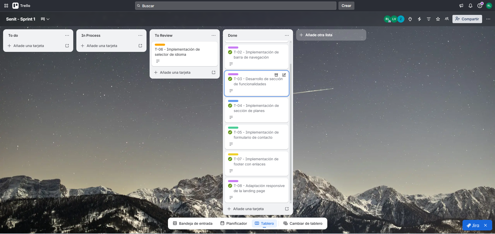
   
  <i>Figura del Board del Sprint 1 de Senit en Trello.</i>

**URL del board:**  
https://trello.com/invite/b/69ec151eac617eff2b332939/ATTId73f9e31a7aca31bff56c7691b2e9e94E8A97DF0/senit-sprint-1

#### 5.2.1.4. Development Evidence for Sprint Review.
En esta primera iteración el equipo tuvo la decisión de enfocarse primordialmente en la construcción de la primera versión de la landing page de Senit, y por este motivo los resultados de esta iteración tenía que ver con la creación de la estructura del producto, la generación de recursos visuales, definición de las User Stories asociadas a la landing page, así como el desarrollo de wireframes y mockups en su versión desktop y mobile (no considerando en esta iteración el desarrollo de la Web Application o de los Web Services, ya que el alcance de la iteración sólo fue la landing page).

| Repository | Branch | Commit Id | Commit Message | Commit Message Body | Commited on (Date) |
|------------|--------|-----------|----------------|---------------------|--------------------|
| SENIT-Aplicaciones-Web/SENIT_Final-Report | main | 5c95dee | docs: add project structure | - | 17/04/2026 |
| SENIT-Aplicaciones-Web/SENIT_Final-Report | main | d13c194 | docs: added 8 user stories about the landing page | - | 18/04/2026 |
| SENIT-Aplicaciones-Web/SENIT_Final-Report | main | 01320f7 | docs: add landing page wireframes | - | 22/04/2026 |
| SENIT-Aplicaciones-Web/SENIT_Final-Report | main | df9a7f9 | docs: add landing page hero section mockup | - | 23/04/2026 |
| SENIT-Aplicaciones-Web/SENIT_Final-Report | main | 1594528 | docs: add landing page mock ups | - | 24/04/2026 |
| SENIT-Aplicaciones-Web/senit-landing-page | main | 067428d | Initial commit | - | 24/04/2026 |
| SENIT-Aplicaciones-Web/senit-landing-page | main | a1541c5 | docs: add description of senit | - | 24/04/2026 |
| SENIT-Aplicaciones-Web/senit-landing-page | main | 60adb91 | feat: add landing page v1 | - | 25/04/2026 |

#### 5.2.1.5. Execution Evidence for Sprint Review.
En esta sección se presenta una vista de la primera versión funcional de la landing page de Senit implementada durante el Sprint 1.

  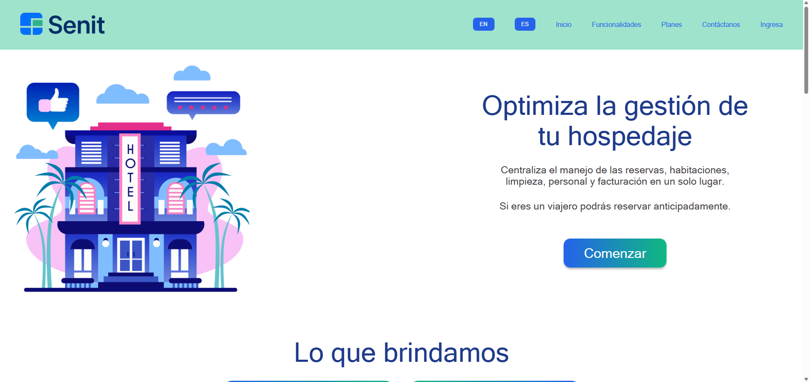
   
  <i>Primera versión funcional de la landing page de Senit durante el Sprint 1.</i>

#### 5.2.1.6. Services Documentation Evidence for Sprint Review.

En este sprint no se implementaron ni se documentaron Web Services. El alcance del Sprint 1 estuvo enfocado únicamente en el desarrollo de la primera versión funcional de la landing page de Senit, por lo que no se trabajó todavía con endpoints ni con documentación técnica asociada a servicios.

Por esa razón, la descripción de endpoints, verbos HTTP, parámetros, respuestas, capturas de documentación y commits vinculados a Web Services no corresponde a esta iteración. Dichos elementos serán abordados en los siguientes sprints, cuando se inicie la construcción e integración del RESTful API del proyecto.
#### 5.2.1.7. Software Deployment Evidence for Sprint Review.
#### 5.2.1.8. Team Collaboration Insights during Sprint.
Para la documentacion de la elaboración de los avances del Sprint 1, que el grupo del proyecto elaboró mediante GitHub su principal elemento de trabajo colaborativo. Regresando a los repositorios del proyecto donde los miembros fueron registrando sus cambios mediante commits y manteniendo actualizados los artefactos que acompañan a la landing page de Senit y a la documentación del informe. En esta iteración se manifestó la participación activa del grupo en la construcción y actualización de los entregables lo cual fue muestra de un trabajo coordinado por la elaboración de la primera versión funcional del producto.

  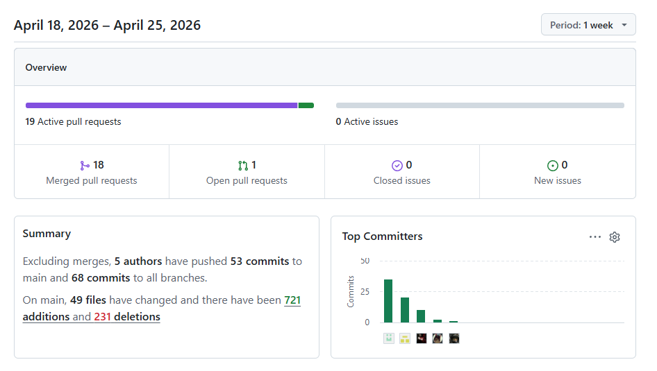
   
  <i>Analíticos de colaboración del equipo durante el Sprint 1 en GitHub.</i>

  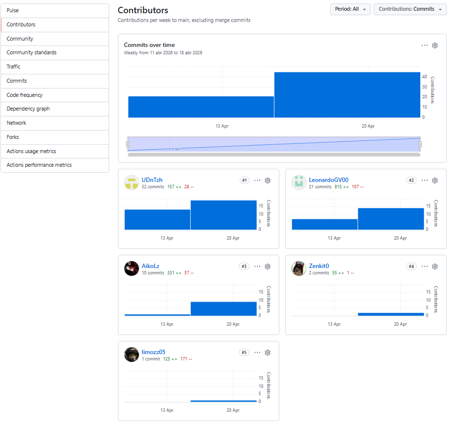
   
  <i>Contribuciones individuales de los integrantes durante el Sprint 1 en GitHub.</i>

---
# Conclusiones
**Conclusiones**

El análisis del sector hotelero en el Perú permitió identificar que una gran parte de los establecimientos de hospedaje aún operan mediante procesos manuales o con herramientas tecnológicas limitadas, lo que genera ineficiencias, errores en la gestión y retrasos en la atención al cliente. A partir de las entrevistas realizadas, se evidenció que tanto el personal administrativo como los huéspedes presentan necesidades claras relacionadas con la rapidez, la organización y la digitalización de procesos, especialmente en actividades críticas como las reservas, el check-in y la facturación.

En este contexto, el desarrollo de Senit como plataforma web surge como una solución pertinente, ya que permite centralizar la gestión de reservas, habitaciones, personal, limpieza y pagos en un solo sistema, mejorando significativamente la eficiencia operativa de los hospedajes. Asimismo, la aplicación de metodologías como Lean UX y Domain-Driven Design (DDD) facilitó la construcción de una solución alineada con las necesidades reales de los usuarios, asegurando que las funcionalidades propuestas aporten valor práctico.

Por otro lado, el uso de herramientas de modelado como diagramas UML, ERD y la definición de bounded contexts permitió comprender de manera estructurada el dominio del problema y diseñar una arquitectura modular, escalable y coherente con la lógica del negocio hotelero. Finalmente, los avances logrados durante el Sprint 1 evidencian una base sólida para el desarrollo del proyecto, especialmente en la definición del producto, la validación de la problemática y la construcción inicial de la solución.  

**Recomendaciones**

Se recomienda continuar con el desarrollo del sistema, enfocándose principalmente en la implementación del backend y la integración de servicios que permitan materializar las funcionalidades propuestas en la etapa inicial. Asimismo, es importante realizar pruebas con usuarios reales, tanto administradores como huéspedes, utilizando prototipos más avanzados, con el fin de validar la usabilidad del sistema y detectar oportunidades de mejora antes de su despliegue.

También se sugiere incorporar mecanismos de seguridad robustos para proteger la información sensible de los usuarios, especialmente considerando que el sistema gestionará datos personales y transacciones económicas. De igual manera, es fundamental optimizar la experiencia de usuario, priorizando la reducción de tiempos en procesos clave como el check-in, las reservas y la emisión de comprobantes, ya que estos representan los principales puntos de dolor identificados.

Adicionalmente, se recomienda evaluar la integración con servicios externos, como pasarelas de pago y plataformas de reservas, lo que permitirá incrementar el valor del sistema y su competitividad en el mercado. Finalmente, se sugiere implementar el sistema de manera progresiva en pequeños y medianos hospedajes, manteniendo una retroalimentación constante con los usuarios, lo que permitirá iterar y mejorar la solución de acuerdo con las necesidades reales del entorno.

# Bibliografía

Ministerio de Comercio Exterior y Turismo. (2023). Perú: oferta y demanda de establecimientos de hospedaje, año 2023. 
https://www.gob.pe/institucion/mincetur/informes-publicaciones/5671698-informe-peru-oferta-y-demanda-de-establecimientos-de-hospedaje-ano-2023

# Anexos
Video AV1: https://upcedupe-my.sharepoint.com/:f:/g/personal/u20231h059_upc_edu_pe/IgDp_fp4esChRK6kbuD7hr3rAY1MNhbgV34AeZQecIMnPSs?e=QLhQg8

  
